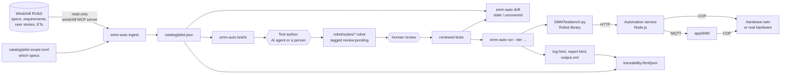
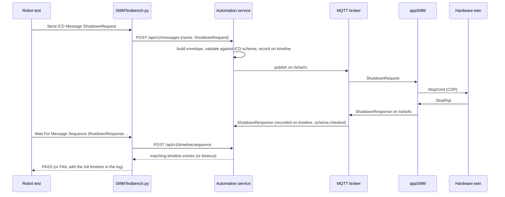
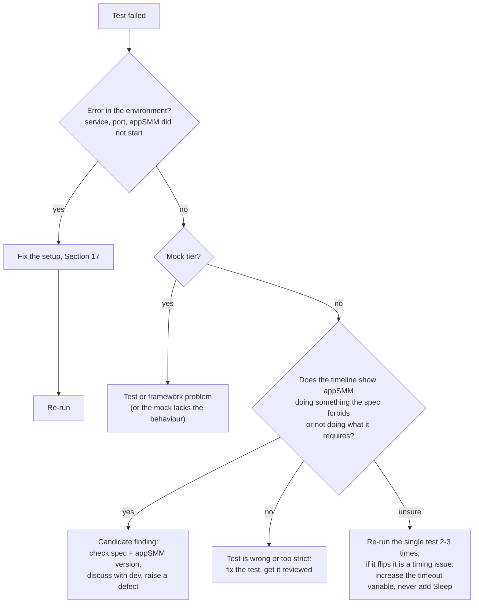
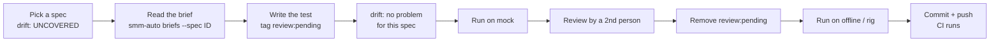
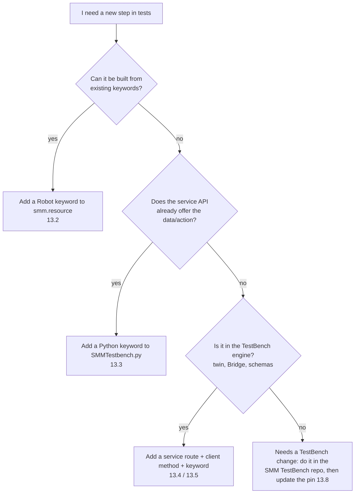

# SMM Test Automation Framework — The Complete Handbook

> **Who is this for?** Anyone who has to use, maintain or extend the SMM test automation framework,
> **including people who are not programmers** and people who were not involved when it was built.
> It assumes no AI assistant is available. Everything the AI did can be done by hand by following
> this document.
>
> **Where is the framework?** In the repository `D:\projects\AI-TestBench`, folder `smm-automation\`.
> All paths in this handbook are relative to `D:\projects\AI-TestBench` unless stated otherwise.

---

## Contents

0. [How to read this handbook](#0-how-to-read-this-handbook)
1. [The framework in plain words](#1-the-framework-in-plain-words)
2. [Glossary](#2-glossary)
3. [The big picture](#3-the-big-picture)
4. [How and why it was built this way](#4-how-and-why-it-was-built-this-way)
5. [A tour of the files](#5-a-tour-of-the-files)
6. [Installing everything on a new PC](#6-installing-everything-on-a-new-pc)
7. [Running the tests](#7-running-the-tests)
8. [Reading the results](#8-reading-the-results)
9. [Writing a new test — step-by-step tutorial](#9-writing-a-new-test--step-by-step-tutorial)
10. [Keyword reference](#10-keyword-reference)
11. [Tags and rules — the checklist](#11-tags-and-rules--the-checklist)
12. [Working with RV&S: scope, catalog, drift and briefs](#12-working-with-rvs-scope-catalog-drift-and-briefs)
13. [Extending the framework](#13-extending-the-framework)
14. [How it works inside (deep dive)](#14-how-it-works-inside-deep-dive)
15. [Continuous integration (CI)](#15-continuous-integration-github-actions)
16. [Known appSMM behaviour and current findings](#16-known-appsmm-behaviour-and-current-findings)
17. [Troubleshooting and FAQ](#17-troubleshooting-and-faq)
18. [Maintenance checklists](#18-maintenance-checklists)
19. [Quick reference card](#19-quick-reference-card)

---

## 0. How to read this handbook

You do not need to read everything. Pick your path:

| You want to… | Read |
|---|---|
| Understand what this is | 1, 2, 3 |
| Set up a PC and run the tests | 6, 7, 8 |
| Write new tests | 9, 10, 11 (and 12 for where the specifications come from) |
| Fix something that broke | 17, then 14 |
| Add new capabilities (new keywords, new hardware actions, a new product) | 13, 14 |
| Keep the framework healthy over time | 18 |

Conventions used in this handbook:

- `Text like this` is something you type, a file name or a value.
- A block like the one below is a command to type in **PowerShell** (the blue/black Windows command window).
  Type it exactly, then press Enter.

  ```powershell
  cd D:\projects\AI-TestBench\smm-automation
  ```

- "**Do not**" boxes mark mistakes that are easy to make and expensive to fix.

> **How to open PowerShell:** press the Windows key, type `PowerShell`, press Enter. To go to a folder, type
> `cd ` followed by the folder path in quotes if it contains spaces, e.g. `cd "D:\projects\SMM TestBench"`.

---

## 1. The framework in plain words

### 1.1 What problem does it solve?

The **SMM** (Stratec 7251 Sample Management Module) is an instrument that moves sample racks around. Its
software, **appSMM**, talks to the outside world (the **SMM Bridge**, which sits between the SMM and the
analyzers) by exchanging short JSON messages over a message system called **MQTT**. The exact messages and
their meaning are defined in the **ICD** (Interface Control Document).

What appSMM must do is written down in **Windchill RV&S** (also known as PTC Integrity or MKS) as
**specifications**, which are linked to **requirements**, **user stories** and **Explorative Tests** (manual
tests people already did).

Until now, checking that appSMM behaves as specified meant a person sitting at the **SMM TestBench** (a desktop
application that can pretend to be the Bridge and that can simulate the hardware), clicking buttons and
watching messages. This is slow, hard to repeat exactly, and leaves little evidence behind.

**This framework does the same thing automatically.** A test is a short, readable text file that says, for
example:

> "Bring the SMM to Idle. Send a ShutdownRequest. Expect a ShutdownResponse, then a notification that the state
> changed from Idle to E-Stop."

The computer executes those steps against appSMM, checks every answer, and produces a report that says, per
RV&S specification, whether appSMM passed or failed.

### 1.2 An analogy

Think of appSMM as a **new employee** and the specifications as their **job description**.

- The **TestBench** is a **training room** with fake customers (the simulated Bridge) and a fake machine (the
  simulated hardware, the "hardware twin").
- A **Robot test** is an **exam question**: "When a customer asks X, you must answer Y within 10 seconds."
- The **automation service** is the **examiner** who sits in the training room, plays the customer, operates the
  fake machine and writes down everything that is said (the "timeline").
- The **report** is the **exam result**, sorted by line of the job description.

### 1.3 What the framework does, in four stages

1. **Collect** — reads the specifications (and their requirements, user stories, Explorative Tests) from RV&S and
   stores them in a file called the **catalog**. Nothing is ever changed in RV&S; access is read-only.
2. **Write** — for every specification a test is written in Robot Framework language. An AI agent can draft it
   from a "brief" (a summary page per specification); **a human always reviews it**. People can also write
   tests completely by hand (Section 9).
3. **Run** — the tests are executed against appSMM on one of three "tiers" (a simulated appSMM, the real appSMM
   with simulated hardware, or the real instrument).
4. **Report** — Robot Framework's own log and report, plus a **traceability report** that maps every result back to
   the RV&S specification, requirement and user story.

### 1.4 What it does **not** do

- It does **not** write to RV&S. Results are not uploaded automatically (they can be copied in by hand).
- It does **not** change the SMM TestBench. It reuses the TestBench code as-is, at a fixed version.
- A test on the **mock** tier proves the framework works, **not** that appSMM works (Section 7.1).
- It does not replace human judgement: every generated test needs a review, and every failure needs triage
  ("is appSMM wrong, or is the test wrong?").

---

## 2. Glossary

| Term | Meaning |
|---|---|
| **SMM** | Stratec 7251 Sample Management Module — the instrument under test. |
| **appSMM** | The SMM control software (a Windows program, `appSMM.exe`). This is what we test. Pilot version: 0.7.2305.25001. |
| **rtc_appl** | The firmware on the SMM's real-time controller board. appSMM sends it commands (e.g. `InitializeCmd`) over the **COP** protocol. |
| **COP / ICOL** | The protocol and message catalog between appSMM and rtc_appl. The hardware twin speaks it. |
| **SMM Bridge** | The software between the SMM and the analyzers. In our tests **the framework plays the Bridge**. |
| **IW / HCA / analyzer** | Parts of the system the Bridge represents. `/is/iw/...` topics carry system messages, `/is/hcaN/...` topics carry messages for analyzer N. |
| **ICD** | Interface Control Document: the list of messages (e.g. `ShutdownRequest`), their fields and their **JSON schemas**. The pilot uses ICD v7 (51 schemas). |
| **JSON** | A text format for structured data, e.g. `{"Status": "OK"}`. |
| **JSON schema** | A file that describes what a valid JSON message looks like. Used to check every message appSMM sends. |
| **MQTT** | A publish/subscribe message system. Programs send ("publish") messages to named **topics**; others receive them by subscribing. |
| **Broker** | The MQTT post office that passes messages between programs. We use **Mosquitto** (offline tier), an embedded broker called **aedes** (mock tier) or the instrument's broker (rig tier). |
| **Topic** | The "address" of an MQTT message, e.g. `/is/iw/rx`. **rx** = towards appSMM ("received by SMM"), **tx** = from appSMM ("transmitted by SMM"). |
| **System state** | appSMM's current mode: `PowerOn`, `NotInitialized`, `Initializing`, `Idle`, `Clearing`, `Configuring`, `NormalOperation`, `E-Stop`. |
| **E-Stop** | Emergency stop state. Entered on ShutdownRequest, emergency stop button, fatal errors. Left with `RecoverRequest`. |
| **SMM TestBench** | The existing desktop tool (repo `ionut2026/SMM-TestBench`, at `D:\projects\SMM TestBench`). Has two apps: **simulator** (Bridge side) and **hwsim** (hardware side, the twin). |
| **Hardware twin** | The simulated SMM hardware inside hwsim. It answers appSMM's COP commands like the real rtc_appl would, and lets us press buttons, insert trays, etc. |
| **Windchill RV&S** | PTC's requirements tool (formerly PTC Integrity / MKS). Source of specifications. |
| **Specification (SDS)** | One testable statement of how appSMM must behave, e.g. ID 2428419. Tests are tagged `SDS-2428419`. |
| **Requirement** | A higher-level need that specifications "satisfy". |
| **User story** | An agile description of a feature (type `ASD-User Story` in RV&S). |
| **Explorative Test (ET)** | A manual test recorded in RV&S with preconditions, steps and expected results. Useful as inspiration for automated tests. |
| **MCP server** | "Model Context Protocol" server. The `windchill-mcp-server` folder is a small program that gives read-only access to RV&S. The framework uses it to download specifications (no AI needed for that). |
| **Robot Framework** | A free, widely used test automation tool. Tests are written as tables of readable "keywords". Runs on Python. |
| **Keyword** | One step in a Robot test, e.g. `Send ICD Message    ShutdownRequest`. Keywords are like verbs. |
| **Library** | A file (here Python) that implements keywords. Ours: `SMMTestbench.py`. |
| **Resource file** | A Robot file with shared keywords and settings. Ours: `smm.resource`. |
| **Suite** | One `.robot` file containing related tests (e.g. all Shutdown tests). |
| **Tag** | A label on a test (e.g. `SDS-2428419`, `needs:twin`). Used for selection and traceability. |
| **Tier** | Which environment the tests run against: `mock`, `offline` or `rig` (Section 7.1). |
| **Automation service** | A small background program (Node.js/TypeScript) that runs the TestBench engine without a screen and offers it over HTTP to the Robot library. |
| **Timeline** | The service's recording of every message sent and received during a run, with time stamps and schema check results. |
| **Mark** | A position on the timeline. Waits look only at messages after the last mark, so an old message cannot accidentally satisfy a new check. |
| **Catalog** | `catalog/pilot.json`: the specifications (and linked items) downloaded from RV&S. |
| **Scope file** | `catalog/pilot.scope.toml`: the list of specifications we want to cover. |
| **Spec hash** | A fingerprint of a specification's text. If someone edits the text in RV&S, the fingerprint changes and the tests written for the old text are flagged as **stale**. |
| **Drift check** | `smm-auto drift`: compares the tests with the catalog (stale, uncovered, orphan tests…). |
| **Brief** | A generated Markdown page per specification with everything needed to write its test. |
| **Pin / lock file** | `testbench.lock.json`: the exact TestBench version (git commit) the framework is built from. |
| **venv** | A Python "virtual environment": a private Python installation in `smm-automation\.venv` with exactly the packages the framework needs. |
| **npm / Node.js** | The JavaScript runtime and its package manager. Used for the automation service. |
| **CI** | Continuous Integration: GitHub runs checks automatically on every change (Section 15). |

---

## 3. The big picture

### 3.1 The whole flow



### 3.2 What happens when one test step runs

Take the line `Send ICD Message    ShutdownRequest` in a test:



### 3.3 The three tiers

| Tier | appSMM | Hardware | Broker | Use it for | Tests left out automatically |
|---|---|---|---|---|---|
| **mock** | A scripted fake appSMM inside the service | none | Embedded (127.0.0.1:1884) | Checking that the **framework** and the tests work. Fast (≈1–2 min). **Not evidence about appSMM.** | `needs:twin`, `needs:hardware-action`, `needs:operator`, `needs:applog` |
| **offline** | The **real** `appSMM.exe` on this PC | The **hardware twin** (simulated) | Mosquitto (127.0.0.1:1883) started by the TestBench runner | Real verdicts about appSMM, without an instrument. ≈17 min for the pilot. | `needs:operator` |
| **rig** | The real appSMM on the instrument | Real hardware | The instrument's broker (`SMM_RIG_BROKER`) | Final verification on the dedicated automation instrument. | `needs:twin`; without `--operator`: `needs:hardware-action`, `needs:operator`; without a rig control script (`SMM_RIG_CONTROL`): `requires:restart`, `requires:broker-restart`, `needs:applog` |

Tests tagged `review:pending` (no human review yet) **run on every tier**, but the report labels them **UNREVIEWED**
and their specification can never be **VERIFIED** (Section 8.3). Use `--exclude-pending` to leave them out.

---

## 4. How and why it was built this way

This section records the decisions, so that whoever maintains the framework knows **why** things are the way
they are and what would break if they were changed.

### 4.1 Timeline of the work

1. **Investigation.** Three things were studied: the SMM TestBench (Bridge simulator + hardware simulator, written in
   TypeScript/Electron), the Windchill MCP server (read-only access to RV&S), and the RV&S content for the SMM
   (specifications in the "7251 SDS Workflow" and "Event Handling" documents, plus requirements, user stories
   and Explorative Tests).
2. **Design.** Robot Framework vs Playwright was compared, and the architecture below was chosen. Pilot areas:
   Initialization, Recover, Shutdown, System Status, Bridge connection (26 specifications).
3. **Build.** The automation service, the Robot library, the pipeline (ingest/drift/briefs/report), the five pilot suites,
   the CLI, CI and the AI authoring agent were implemented.
4. **Triage on the real appSMM** (offline tier). Test bugs were fixed; real differences between appSMM 0.7 and the
   specifications were documented as candidate findings (Section 16).
5. **Hand-over.** Merged into `main` of `ionut2026/AI-TestBench`; this handbook was written.

### 4.2 Key decisions and their reasons

| Decision | Why | Consequence for you |
|---|---|---|
| **Robot Framework** (not Playwright) | The SMM has no web UI to click; tests talk MQTT and drive hardware. Robot is made for readable, keyword-driven system tests, is used widely in the medical device industry, produces good HTML reports out of the box, and non-programmers can read and write it. Playwright is a browser-testing tool; its strengths would be unused. | Tests are `.robot` text files. You need Python. |
| **Reuse the TestBench engine, don't copy or rewrite it** | The TestBench already implements the Bridge behaviour, the ICD schemas and a hardware twin. Copying would create two versions that drift apart. | The service is **built from the TestBench source code** at a fixed commit. If the TestBench changes, you update the pin deliberately (Section 13.8). |
| **A headless service between Robot and the TestBench** | The TestBench is TypeScript; Robot is Python. A small HTTP service lets the Python side call the TypeScript engine without a screen. It also lets other tools (or a future Playwright/pytest setup) use the same API. | Tests start the service automatically; you rarely notice it. Its log is in the results folder. |
| **Three tiers** | Developers need fast feedback without hardware (mock); real verdicts need real appSMM (offline); final evidence needs the instrument (rig). The **same test file** runs on all three; only the environment file changes. | Use tags (`needs:twin`, `requires:restart`) to say what a test needs. |
| **RV&S is read-only** | Safety: an automation tool must never alter controlled requirements. | Results are attached to RV&S by hand if needed. |
| **Every test is tagged with the spec ID and a hash of the spec text** | Traceability (which test proves which spec) and change detection (the spec changed → the test must be re-reviewed). | Never invent or edit a `spechash:` tag except after a review (Section 12.5). |
| **AI drafts, a human approves** (`review:pending`) | AI can misread a specification. Generated tests run but are labelled UNREVIEWED, and no specification counts as verified, until a person has reviewed them. | Removing `review:pending` is a deliberate review sign-off. |
| **Wait for events, never `Sleep`** | Timing on real hardware varies. Fixed pauses make tests slow and flaky. | Use the `Wait For ...` keywords. |
| **Time windows ("marks")** | Prevents a message from an earlier step from being mistaken for the answer to a later one. | Section 10.2 explains how `since=` works. |
| **Windows + Python 3.12 + Node.js** | appSMM and the TestBench run on Windows; the TestBench needs Node; Robot needs Python. | Section 6. |

### 4.3 What was considered and rejected

- **Driving the TestBench GUI** (clicking its Electron windows with Playwright): fragile, slow, and the GUI is
  not the thing under test.
- **Writing a new MQTT simulator in Python**: duplicates the TestBench, and two simulators would disagree.
- **Writing results back into RV&S automatically**: rejected for safety; can be added later as a separate,
  reviewed step.

---

## 5. A tour of the files

### 5.1 Repository overview

```
D:\projects\AI-TestBench\
├── .github\
│   ├── agents\smm-test-author.agent.md   AI agent instructions for writing tests
│   ├── agents\smm-test-reviewer.agent.md AI agent instructions for reviewing tests
│   └── workflows\smm-automation.yml      CI (automatic checks on GitHub)
├── docs\
│   ├── ARCHITECTURE.md                   Technical summary (MCP server + framework)
│   └── SMM-AUTOMATION-HANDBOOK.md        This handbook
├── windchill-mcp-server\                 Read-only RV&S access program (Node.js)
│   └── docs\windchill-without-ai.md      How to query RV&S by hand
└── smm-automation\                       THE FRAMEWORK
    ├── README.md                         Short user guide
    ├── pyproject.toml                    Python package definition (dependencies, smm-auto command)
    ├── testbench.lock.json               Pinned SMM TestBench commit and default location
    ├── .gitignore                        Files git must not store (venv, results, builds)
    ├── catalog\
    │   ├── pilot.scope.toml              WHICH specifications are in scope (edit by hand)
    │   ├── pilot.json                    The catalog downloaded from RV&S (generated, committed)
    │   ├── state-matrix.toml             State x request matrix model (edit by hand, Section 9.13)
    │   └── state-matrix.questions.md     Open questions of the matrix (generated, committed)
    ├── robot\
    │   ├── resources\smm.resource        Shared Robot keywords + default timeouts
    │   ├── resources\state_matrix.resource  Template keywords of the generated matrix suite
    │   ├── environments\                 One settings file per tier
    │   │   ├── mock.py
    │   │   ├── offline.py
    │   │   └── rig.py
    │   └── suites\pilot\                 THE TESTS (one file per area)
    │       ├── bridge_connection.robot
    │       ├── initialization.robot
    │       ├── recover.robot
    │       ├── robustness.robot          Malformed / misrouted input, duplicate and burst requests
    │       ├── shutdown.robot
    │       ├── state_matrix.robot        GENERATED by smm-auto matrix (do not edit)
    │       └── system_status.robot
    ├── src\smm_automation\               Python code
    │   ├── SMMTestbench.py               The Robot keyword library
    │   ├── client.py                     Talks HTTP to the service; starts it if needed
    │   ├── sil.py                        Reads appSMM's SmartInspect .sil log files
    │   ├── cli.py                        The smm-auto command
    │   ├── __init__.py, __main__.py      Package boilerplate (FRAMEWORK_ROOT, python -m smm_automation)
    │   └── pipeline\
    │       ├── rvs.py                    Talks to the windchill MCP server
    │       ├── ingest.py                 Builds the catalog from RV&S
    │       ├── drift.py                  Compares tests with the catalog
    │       ├── matrix.py                 Generates the state x request matrix suite
    │       ├── briefs.py                 Writes one brief per specification
    │       └── report.py                 Builds the traceability report
    ├── service\                          The automation service (TypeScript)
    │   ├── package.json, package-lock.json, tsconfig.json, vitest.config.ts
    │   ├── build.mjs                     Builds dist\smm-automation-service.mjs
    │   ├── testbench.mjs                 Finds the TestBench and checks the pin
    │   ├── src\
    │   │   ├── main.ts                   Program start (port, shutdown handling)
    │   │   ├── testbench.ts              The ONLY file that imports TestBench code
    │   │   ├── api\server.ts             The HTTP API (all routes)
    │   │   ├── environment.ts            Starts/stops broker, appSMM, hardware per tier
    │   │   ├── copFaults.ts              COP fault injection between appSMM and the twin
    │   │   ├── bridgeSession.ts          Plays the Bridge: MQTT, timeline, waits
    │   │   ├── messageFilter.ts          Matching rules for "wait for message"
    │   │   └── mock\mockAppSmm.ts        The fake appSMM for the mock tier
    │   └── test\                         Service self-tests (vitest)
    ├── tests\                            Python self-tests (pytest)
    ├── generated\                        (created on demand, not committed) briefs
    └── results\                          (created on demand, not committed) run outputs
```

### 5.2 Which files will I edit, and how often?

| File | Who edits it | How often | Risk |
|---|---|---|---|
| `robot\suites\**\*.robot` | Test authors | Every new or changed test | Low — CI and drift catch mistakes |
| `catalog\pilot.scope.toml` (or a new scope file) | Test lead | When scope changes | Low |
| `catalog\pilot.json` | Nobody by hand — `smm-auto ingest` writes it | After RV&S changes | Do not edit by hand |
| `robot\resources\smm.resource` | Test automation engineer | When a reusable step is needed | Medium — used by every suite |
| `robot\environments\*.py` | Test automation engineer | New timeouts, new site | Medium |
| `src\smm_automation\SMMTestbench.py` | Python developer | New keyword | Medium — add a pytest |
| `service\src\**` | TypeScript developer | New hardware action or API | Higher — run `npm test` |
| `testbench.lock.json` | Maintainer | When adopting a new TestBench version | Higher — Section 13.8 |
| `.github\agents\smm-test-author.agent.md` | Maintainer | When authoring rules change | Low |
| `.github\agents\smm-test-reviewer.agent.md` | Maintainer | When authoring or review rules change | Low |

### 5.3 Each file in one paragraph

**`smm-automation\pyproject.toml`** — Defines the Python package `smm-automation`: its dependencies
(Robot Framework, `mcp` for RV&S access, `requests`, …), the `dev` extras (pytest, ruff, mypy, Robocop, pip-tools),
the tool settings (ruff, mypy, coverage floor, Robocop) and the command `smm-auto` (which runs
`smm_automation.cli:main`). **`smm-automation\requirements-dev.lock`** pins the exact version of every Python package
(generated from `pyproject.toml` with `pip-compile`); installs use it so every PC and CI get the same versions.

**`testbench.lock.json`** — The exact git commit of the SMM TestBench that the service is built from
(`c55073075f06…`) and its default folder (`D:\projects\SMM TestBench`). The build refuses another commit unless
`SMM_TESTBENCH_ALLOW_UNPINNED=1` is set. This guarantees that a test result can be reproduced months later.

**`catalog\pilot.scope.toml`** — A plain text file listing the specification IDs in scope, plus: `[not_testable]`
(IDs with a reason why they can't be tested at the ICD), `[deferred]` (testable later; reason shown in the
report), `[specifications]` (the IDs in scope, grouped by area = suite), `retired_states`, `[areas]` (keyword fallback
for the suite), and optional `[[searches]]` (RV&S queries that add more IDs). Section 12.1.

**`catalog\pilot.json`** — Generated by `smm-auto ingest`. Contains every in-scope specification with its text,
state, hash, linked requirements, user stories, Explorative Tests (split into preconditions/steps/expected), the
ICD messages it mentions, its area and its accepted state/link **baseline** (changed only by `smm-auto accept`).
Committed to git so that CI and people without RV&S access can use it.

**`robot\resources\smm.resource`** — Imported by every suite. It loads the Python library and `Collections`,
defines default variables (`${TIER}`, timeouts) and shared keywords: `Open SMM Test Environment` (suite setup),
`Close SMM Test Environment` (suite teardown), `Restart appSMM And Wait Until NotInitialized`,
`Require Hardware Twin`, `Bring SMM To E-Stop With Shutdown`, `Finish SMM Test And Empty The Instrument`,
`Messages From appSMM Should Use Topic`.

**`robot\environments\<tier>.py`** — Robot "variable files". They override `${TIER}`, `${OVERRIDES}` and the
timeouts for that tier. `smm-auto run --tier X` passes `robot\environments\X.py` to Robot.

**`robot\suites\pilot\*.robot`** — The tests, one file per area. Every file has the same `*** Settings ***` block
(copy it for new suites).

**`src\smm_automation\SMMTestbench.py`** — The Robot library: ~40 keywords. Each keyword is a Python method
marked `@keyword`; it calls the service through `client.py` and turns the answer into PASS/FAIL with a clear
message. Section 10 lists them all.

**`src\smm_automation\client.py`** — A small HTTP client for the service (`http://127.0.0.1:8765/api/v1`, or
`SMM_AUTOMATION_URL`). If no service is running, it **starts one automatically** with Node.js, writing its output to
`automation-service.log` in the Robot output folder. It checks the service's API version (major version must be 1)
and sends the service's API token with every request (section 14.3).

**`src\smm_automation\cli.py`** — The `smm-auto` command: `ingest`, `briefs`, `drift`, `matrix`, `run`, `report`,
`service`. Section 7.4 and 19.

**`src\smm_automation\pipeline\rvs.py`** — Starts `windchill-mcp-server\src\server.js` with Node.js and calls its
read-only tools (`rvs_get_items`, `rvs_search_items`). Connection settings come from `RVS_*` environment
variables or, if missing, from the windchill entry of `%USERPROFILE%\.copilot\mcp-config.json`.

**`pipeline\ingest.py`** — Builds the catalog: gets the specifications, follows their links ("Satisfies" →
requirements, "Described In" → user stories, "Relevant Explorative Test" → ETs), computes the text hash,
classifies the area, and reports what changed since the previous catalog.

**`pipeline\drift.py`** — Reads every Robot test (without running it) and compares its tags with the catalog.
Categories: stale, orphan, untagged, nohash, uncovered, suspect, pending (Section 12.4); tests tagged
`nospec:<kind>` are listed apart, as information.

**`pipeline\matrix.py`** — Reads `catalog\state-matrix.toml`, checks it against the catalog and the existing tests
and writes `robot\suites\pilot\state_matrix.robot` and `catalog\state-matrix.questions.md` (Section 9.13).

**`pipeline\briefs.py`** — Writes `generated\briefs\SDS-<id>.md`: spec text, requirements, user stories, ETs, the
ICD schemas of mentioned messages, existing tests, the full keyword list and the authoring rules.

**`pipeline\report.py`** — Joins Robot's `output.xml` with the catalog to produce `traceability.html` and
`traceability.json` (Section 8.3).

**`service\build.mjs` / `service\testbench.mjs`** — Build scripts. `testbench.mjs` locates the TestBench
(`SMM_TESTBENCH_DIR` or the lock file's `defaultDir`), checks that `npm ci` was run in `simulator` and `hwsim`,
reads its commit and compares it with the pin. `build.mjs` bundles the service **together with the TestBench
source files** into one file, `dist\smm-automation-service.mjs`, using esbuild. Import aliases:
`@tb/sim/…` → `simulator\src\…`, `@tb/hw/…` → `hwsim\src\…`, `@shared/…` → the importing app's `src\shared\…`.

**`service\src\testbench.ts`** — The single doorway to TestBench code. Re-exports the Bridge engine
(`BeaconEngine`, `MqttLink`, `SchemaRegistry`, `Timeline`, `PairChecker`, ICD helpers) and the hardware side
(`HardwareTwin`, `CopServer`, `Runner` that starts Mosquitto and appSMM). If a TestBench update renames something,
this is the only file to fix.

**`service\src\api\server.ts`** — Defines every HTTP route (Section 14.3) and maps errors to HTTP codes.

**`service\src\environment.ts`** — Knows the tiers (`presetFor`): starts the broker, appSMM and hardware for the
chosen tier, restarts appSMM or the broker, collects their logs.

**`service\src\copFaults.ts`** — Wraps the COP link between the real appSMM and the hardware twin (offline) and
drops, delays or answers with an error the messages that match the fault rules of `/hardware/faults` (Section 10.8.1).

**`src\smm_automation\sil.py`** — Reads appSMM's SmartInspect `.sil` log files (binary, rotating) and extracts the
ICD messages appSMM logged; used by the log keywords (Section 10.8.3).

**`service\src\bridgeSession.ts`** — The headless Bridge: connects to the broker, publishes ICD messages,
records everything on the timeline, validates schemas, detects request/response pairing problems ("pair issues")
and implements the waits.

**`service\src\messageFilter.ts`** — The matching language for waits (partial match, dotted keys, `$in`, `$regex`, …).

**`service\src\mock\mockAppSmm.ts`** — A scripted imitation of appSMM's state machine for the mock tier. It follows
the appSMM handlers and the SDS texts but is **not** a reference for correct behaviour.

**`service\test\*.test.ts`** and **`tests\*.py`** — Self-tests of the framework (47 vitest tests, 82 pytest tests).
They test the framework, not appSMM.

**`.github\agents\smm-test-author.agent.md`** — Instructions for the AI test author (input = brief, output = test
tagged `review:pending`, self-checks, hand-over notes for the reviewer). It contains the full authoring method: spec
analysis, precondition recipes, which assertion keyword proves which kind of spec sentence, measured appSMM behaviour,
a self-review checklist and the verification steps. Also the best checklist for human authors.

**`.github\agents\smm-test-reviewer.agent.md`** — Instructions for the AI test reviewer: an independent, read-only
second opinion that maps every spec outcome to an assertion, looks for false passes/false fails, runs the mock tier and
returns APPROVE / CHANGES REQUESTED / REJECT per test, recorded in the ledger as `agent:<model>` (information only).
The human still decides and removes `review:pending`.

**`.github\workflows\smm-automation.yml`** — CI definition (Section 15).

---

## 6. Installing everything on a new PC

Do this once per PC. Follow the steps in order; each ends with a **check** so you know it worked.
Time needed: about 30–60 minutes.

### 6.1 What you need

| Software | Version | Why | Get it from |
|---|---|---|---|
| Windows | 10/11 | appSMM and the TestBench are Windows programs | — |
| Git | any recent | Download the repositories | https://git-scm.com |
| Node.js | 20 or newer (CI uses 24) | Runs the automation service and the RV&S MCP server | https://nodejs.org (LTS) |
| Python | **3.12** (3.11 minimum) | Runs Robot Framework and the `smm-auto` command | https://www.python.org — tick "Add python.exe to PATH" and "py launcher" |
| SMM TestBench repository | the pinned commit | The engine the service is built from | `ionut2026/SMM-TestBench` on GitHub |
| appSMM | e.g. 0.7.2305.25001, at `D:\smm\appSMM\appSMM.exe` | Only for the **offline** tier | Internal release share |
| Mosquitto | as required by the TestBench runner | Only for the **offline** tier (the TestBench runner starts it) | https://mosquitto.org |
| Access to RV&S + the RV&S client logged in | — | Only for `smm-auto ingest` | IT / tool admin |

**Check:** open a **new** PowerShell window and run:

```powershell
git --version; node --version; py -3.12 --version
```

You should see three version numbers. If one says "not recognized", install it (and open a new PowerShell
window afterwards).

### 6.2 Get the two repositories

```powershell
cd D:\projects
git clone https://github.com/ionut2026/AI-TestBench.git
git clone https://github.com/ionut2026/SMM-TestBench.git "SMM TestBench"
```

(Skip a line if the folder already exists.)

### 6.3 Put the SMM TestBench on the pinned version

The framework is built from one exact version of the TestBench. Find it in
`D:\projects\AI-TestBench\smm-automation\testbench.lock.json` (field `commit`). Then:

```powershell
cd "D:\projects\SMM TestBench"
git fetch
git checkout c55073075f06ba28e7c2d934d8a20a9e73931a06
npm ci --prefix simulator
npm ci --prefix hwsim
```

> **Do not** edit files in the SMM TestBench folder. The framework reads its source code; any change there changes
> the behaviour of every test. If the TestBench is somewhere else, set the environment variable `SMM_TESTBENCH_DIR`
> (Section 6.7).

**Check:** `git -C "D:\projects\SMM TestBench" rev-parse HEAD` prints the pinned commit, and the folders
`simulator\node_modules` and `hwsim\node_modules` exist.

### 6.4 Build and self-test the automation service

```powershell
cd D:\projects\AI-TestBench\smm-automation\service
npm ci
npm run build
npm test
```

**Check:** `npm run build` prints `Built dist/smm-automation-service.mjs from SMM TestBench c550730 …` and `npm test`
ends with all tests passed (21 at the time of writing).

### 6.5 Create the Python environment and self-test it

```powershell
cd D:\projects\AI-TestBench\smm-automation
py -3.12 -m venv .venv
.\.venv\Scripts\python -m pip install --upgrade pip
.\.venv\Scripts\pip install -r requirements-dev.lock
.\.venv\Scripts\pip install --no-deps -e .
.\.venv\Scripts\python -m pytest
```

**Check:** pytest reports all tests passed (34 at the time of writing), and `.\.venv\Scripts\smm-auto --help` prints
the list of commands.

> `-e` means "editable": the venv uses the files in `src\` directly, so your changes to Python files take effect
> without reinstalling. Re-run the two `pip install` lines only when `pyproject.toml` or `requirements-dev.lock` changes.
> When you change a dependency in `pyproject.toml`, regenerate the lock and commit both:
> `.\.venv\Scripts\pip-compile --extra dev --strip-extras --no-emit-index-url -o requirements-dev.lock pyproject.toml`.

### 6.6 First run: the mock tier

```powershell
cd D:\projects\AI-TestBench\smm-automation
.\.venv\Scripts\smm-auto run --tier mock
```

**Check:** the run ends with all tests passed (21 at the time of writing) and prints the path of the
traceability report. The results are in `results\mock-<date>-<time>\`. Open `report.html` there by double-clicking.

You now have a working installation. For the offline tier continue with 6.7.

### 6.7 Settings (environment variables)

Settings that differ per PC are passed as **environment variables**. Set them for the current PowerShell window
with `$env:NAME = "value"`, or permanently via *Start → "Edit environment variables for your account"*.

| Variable | Default | Used for |
|---|---|---|
| `SMM_TESTBENCH_DIR` | `D:\projects\SMM TestBench` | Where the TestBench is |
| `SMM_TESTBENCH_ALLOW_UNPINNED` | not set | Set to `1` to allow building from a different TestBench commit (prints a warning). For experiments only. |
| `SMM_APPSMM_EXE` | the TestBench runner's setting (`D:\smm\appSMM\appSMM.exe`) | appSMM to start in the offline tier |
| `SMM_RIG_BROKER` | `10.0.1.111:1883` (**a placeholder — set the real one**) | Broker of the rig instrument, `host:port` |
| `SMM_AUTOMATION_URL` | `http://127.0.0.1:8765/api/v1` | Where the Python side finds the service |
| `SMM_AUTOMATION_PORT` / `SMM_AUTOMATION_HOST` | `8765` / `127.0.0.1` | Where the service listens (service side) |
| `SMM_AUTOMATION_TOKEN` | not set: the service generates one | API token of the service (both sides). Without it the service writes a generated token to `.service\token-<port>` and the Python side reads it from there. |
| `SMM_AUTOMATION_TOKEN_FILE` | `.service\token-<port>` | Where the service writes its token (service side) |
| `SMM_AUTOMATION_QUIET` | not set | `1` = the service does not print environment logs |
| `SMM_TIMELINE_CAP` / `SMM_TRACE_CAP` | `20000` / `10000` | How many timeline / COP trace entries the service keeps (minimum 100). A test whose evidence was dropped fails. |
| `WINDCHILL_MCP_SERVER` | `windchill-mcp-server\src\server.js` | RV&S access program used by `ingest` |
| `RVS_HOSTNAME`, `RVS_*` | from `%USERPROFILE%\.copilot\mcp-config.json` | RV&S connection (see `windchill-mcp-server` docs) |

Example for the offline tier with appSMM in another folder:

```powershell
$env:SMM_APPSMM_EXE = "E:\builds\appSMM-0.8\appSMM.exe"
.\.venv\Scripts\smm-auto run --tier offline
```

### 6.8 Offline tier prerequisites

1. appSMM installed (e.g. `D:\smm\appSMM\appSMM.exe`) with its configuration files.
2. Mosquitto installed where the TestBench runner expects it.
3. **Nothing else** using port 1883 (e.g. a second Mosquitto, or the TestBench GUI still running).
4. The TestBench GUI closed (only one Bridge may be connected to the broker at a time).

When the service starts appSMM it **adjusts appSMM's configuration files** so appSMM talks to the local broker and
the hardware twin. The original files are kept next to them with the extension `.orig`.

---

## 7. Running the tests

Always start from the framework folder:

```powershell
cd D:\projects\AI-TestBench\smm-automation
```

### 7.1 Choosing a tier

- **mock** — after changing the framework or writing a new test, to check it runs. Fast. Verdicts say nothing
  about appSMM.
- **offline** — to get real verdicts about appSMM on your PC. Needs appSMM and Mosquitto. Pilot ≈17 minutes.
- **rig** — on the automation instrument. Never uses the twin (`needs:twin` excluded). What else runs depends on
  what the site provides (Section 7.7): a rig control script (`SMM_RIG_CONTROL`) for `requires:restart`,
  `requires:broker-restart` and `needs:applog`, an operator (`--operator console|dialog`) for `needs:hardware-action`
  and `needs:operator`. mock excludes `needs:twin`, `needs:hardware-action`, `needs:operator` and `needs:applog`.

Before a long run, `smm-auto doctor --tier <tier>` checks that the tier can run: service and API version, the pinned
TestBench, `appSMM.exe` and port 1883 (offline), the broker, rig control and operator (rig), and lists the tags the run
would exclude. `--deep` also starts the environment and asks appSMM for its state and version; on the rig this
connects a Bridge to the instrument, so use it only when the instrument's owner agrees.

### 7.2 Most common commands

| I want to… | Command |
|---|---|
| Run everything on mock | `.\.venv\Scripts\smm-auto run --tier mock` |
| Run everything on offline | `.\.venv\Scripts\smm-auto run --tier offline` |
| Run on the rig | `$env:SMM_RIG_BROKER = "<host>:1883"; .\.venv\Scripts\smm-auto run --tier rig` |
| Run one suite (file) | `.\.venv\Scripts\smm-auto --suites robot\suites\pilot\recover.robot run --tier offline` |
| Run one area (by tag) | `.\.venv\Scripts\smm-auto run --tier offline --include area:shutdown` |
| Run the tests of one specification | `.\.venv\Scripts\smm-auto run --tier offline --include SDS-2428419` |
| Run one test by name | `.\.venv\Scripts\smm-auto run --tier mock --test "SDS-2428419 E-Stop Is Notified After ShutdownResponse"` |
| Leave unreviewed tests out | add `--exclude-pending` (they run by default, labelled UNREVIEWED) |
| Fail the run on every failure, also known issues | add `--fail-on any` (default `new`: only failures without `known-issue:` count) |
| Choose the output folder | add `--outdir results\my-run` |
| Skip the traceability report | add `--no-report` |
| Check the environment before a long run | `.\.venv\Scripts\smm-auto doctor --tier offline` (add `--deep` to ask appSMM) |
| Run the operator tests on the rig | add `--operator console` (or `dialog`) after `run` |
| Re-run only failed tests of a run | `.\.venv\Scripts\smm-auto run --tier offline --rerunfailed results\offline-…\output.xml` |

Rules for the command line:

- **Options for `smm-auto` itself** (`--scope`, `--catalog`, `--suites`, `--reviews`) go **before** the word `run`.
- **Options for `run`** (`--tier`, `--operator`, `--outdir`, `--fail-on`, `--exclude-pending`, `--no-report`) go after `run`.
- **Anything else after `run`** is passed straight to Robot Framework (`--include`, `--exclude`, `--test`,
  `--loglevel DEBUG`, `--rerunfailed`, …). See `.\.venv\Scripts\robot --help`.
- `--include` can be repeated (tests matching any of them run). Tag patterns accept `*`, e.g. `--include SDS-2525*`.

### 7.3 What `smm-auto run` does for you

1. Picks the variable file `robot\environments\<tier>.py`.
2. Excludes the tests whose capability tag the tier lacks (it prints them and why: Sections 7.1 and 7.7);
   `review:pending` only with `--exclude-pending`.
3. Runs Robot on `robot\suites` (or the `--suites` you gave) into `results\<tier>-<date>-<time>\`.
4. Builds the traceability report from `output.xml`, the catalog and the review ledger.
5. Prints the failures by class (NEW FAIL, KNOWN FAIL, FIXED?) and exits with the number of **new** failures
   (`--fail-on new`, default), of all failures (`--fail-on any`) or 0 (`--fail-on none`). A run where only
   `known-issue:` tests fail is green. On the mock tier `known-issue:` tags are ignored: the mock follows the
   specification, so every mock failure is new.

It prints the exact `robot …` command it runs, so you can copy and adapt it.

### 7.4 Running Robot directly (without `smm-auto`)

Useful when you want full control:

```powershell
.\.venv\Scripts\robot --variablefile robot\environments\mock.py --exclude needs:twin --exclude needs:hardware-action --exclude needs:operator --exclude needs:applog --outputdir results\manual robot\suites\pilot\shutdown.robot
.\.venv\Scripts\smm-auto report --output results\manual\output.xml
```

### 7.5 What you see while it runs

Robot prints one line per test with `| PASS |` or `| FAIL |`. The first test of a suite takes longer: the service
starts the environment (broker, appSMM, twin) and connects as the Bridge. On the offline tier appSMM initialization
can take minutes; that is normal.

To stop a run: press `Ctrl+C` **once** and wait — Robot runs the teardowns and stops the environment. Pressing it
repeatedly may leave appSMM or Mosquitto running (Section 17.2).

### 7.6 Running the service by hand (optional)

Normally the Robot library starts the service. To watch its live output, start it yourself in a second window
first; tests will then use it:

```powershell
cd D:\projects\AI-TestBench\smm-automation
.\.venv\Scripts\smm-auto service            # or: node service\dist\smm-automation-service.mjs --port 8765
```

Check it in a browser: http://127.0.0.1:8765/api/v1/health. Stop it with `Ctrl+C`. Every other address needs the
service's API token (section 14.3); the service prints where it wrote it.

### 7.7 The rig: rig control script and operator

The rig tier runs the real appSMM on the instrument, so the framework cannot restart appSMM, restart the broker or
read the log files itself, and nobody presses the emergency stop unless an operator is there. Two optional
site settings switch those tests on:

- **Rig control script** — `SMM_RIG_CONTROL` holds a command (e.g. `python D:\rig\rig_control.py`, or a JSON list of
  arguments; run without a shell) that implements `capabilities`, `restart-appsmm --down-ms <ms>`,
  `restart-broker --down-ms <ms>` and `fetch-log <dir>` (the contract is in `src\smm_automation\rigcontrol.py`).
  How it reaches the RTC board (ssh, a service on the board, a power switch…) is up to the site. Only the
  subcommands it lists under `capabilities` are used: `restart-appsmm` enables `requires:restart`,
  `restart-broker` enables `requires:broker-restart`, `fetch-log` enables `needs:applog`. `SMM_RIG_CONTROL_TIMEOUT`
  (seconds, default 300) bounds each call. The log check compares appSMM's timestamps (rig clock) with this PC's
  clock (2 s slack), so keep both NTP-synchronised.
- **Operator** — `smm-auto run --tier rig --operator console` prints each manual step (e.g. "Press the EMERGENCY STOP
  button… then release it") and waits until the operator types `done` (or `fail <reason>`); `--operator dialog`
  shows a PASS/FAIL dialog instead. Each step waits `${OPERATOR_TIMEOUT}` (300 s). This enables
  `needs:hardware-action` (the E-Stop tests) and `needs:operator`. CI never has an operator.

Racks are still `needs:twin` on the rig (e.g. SDS-2535547): putting racks on the real instrument needs an agreed
clean-up procedure first.

```powershell
$env:SMM_RIG_BROKER = "10.0.1.111:1883"
$env:SMM_RIG_CONTROL = "python D:\rig\rig_control.py"
.\.venv\Scripts\smm-auto doctor --tier rig --operator console     # no appSMM traffic without --deep
.\.venv\Scripts\smm-auto run --tier rig --operator console
```

---

## 8. Reading the results

Every run creates a folder `results\<tier>-<YYYYMMDD>-<HHMMSS>\` with:

| File | What it is | Open it when |
|---|---|---|
| `report.html` | Robot's summary: totals, per suite, per tag | First, for the overview |
| `log.html` | Robot's detailed log: every keyword, its arguments, messages, the timeline | A test failed |
| `output.xml` | Machine-readable results (input for the other files) | To rebuild reports, `--rerunfailed`, or archive |
| `traceability.html` | Results per **RV&S specification**, requirement and user story | Reporting to the team / RV&S |
| `traceability.json` | The same, machine-readable | Tools, dashboards |
| `automation-service.log` | Everything the service, broker, appSMM and twin printed | Environment problems |

### 8.1 report.html

Green = all passed, red = something failed. "Statistics by Tag" shows e.g. how many `area:recover` tests passed. Click a
test to jump into `log.html`.

### 8.2 log.html — finding out why a test failed

1. Click the red test. Expand the red keyword: its message says what was expected and what was seen, e.g.
   `No SystemStatusNotification with CurrentState=Idle within 20s`.
2. Scroll to the **teardown** (`Finish SMM Test`). It logs a table **"Timeline of this test"**: every message sent (tx)
   and received (rx), with time, topic, body and whether it matched the ICD schema. For failed tests it also logs the
   last 80 lines of the environment logs (appSMM, broker, twin).
3. Read the timeline like a conversation: what did we send, what did appSMM answer, what was missing?

### 8.3 traceability.html

One row per specification in scope with a verdict:

| Verdict | Meaning |
|---|---|
| **PASS** | Every test of the specification ran on this tier and passed |
| **PARTIAL** | Some of its tests passed, the others were not run on this tier or skipped (e.g. `requires:restart` on rig) |
| **FAIL** | At least one of its tests failed |
| **SKIP** | Its tests were skipped (e.g. `Require Hardware Twin` on a tier without twin) |
| **NOT RUN** | Tests exist but were excluded from this run (tier tags, `--include`, `--exclude-pending`) |
| **UNCOVERED** | Testable, not deferred, but no test exists yet |
| **DEFERRED** | Listed under `[deferred]` in the scope file; the reason is shown |
| **NOT TESTABLE** | Listed under `[not_testable]`; the reason is shown |

Requirements and user stories get the **worst** verdict of their specifications, in this order:
FAIL, NOT RUN, UNCOVERED, SKIP, PARTIAL, DEFERRED, PASS, NOT TESTABLE. Stale tests (spec text changed) are flagged.
On the mock tier the report states that the verdicts are **not product evidence**.

The **Review** column shows **VERIFIED** when the specification passed and every one of its tests has had a human
review, and **UNREVIEWED** when any of its tests is still tagged `review:pending`. A PASS of unreviewed tests is a
result, not evidence. The coverage line counts *passed* and *verified* specifications separately.

Each test is shown with its outcome: PASS, SKIP, **NEW FAIL** (a failure nobody has explained yet: triage it),
**KNOWN FAIL** (the test is tagged `known-issue:FINDING-n`, a documented candidate finding in the README) or
**FIXED?** (a `known-issue:` test passed: check whether the appSMM build fixed the finding, then remove the tag).
New failures and FIXED? tests are listed at the top of the report.

Tests tagged `nospec:<kind>` (robustness tests, matrix cells without a specification; Section 9.13) appear in their
own table **Tests without a specification**. They do not count for any specification, requirement or user story.

### 8.4 What to do with a failure (triage)



Record confirmed differences in the README's "Findings" section (and in RV&S/your defect tracker by hand). Tag the
failing test(s) `known-issue:FINDING-<n>` with the README's finding number, so later runs show them as KNOWN FAIL
and stay green while any **new** failure turns the run red. Remove the tag when the finding is fixed (FIXED?) or
turns out to be a test error.

---

## 9. Writing a new test — step-by-step tutorial

This is the most important section for day-to-day work. It assumes no AI.

### 9.1 Robot Framework in 10 minutes

A `.robot` file is a text file divided into sections that start with `*** Name ***`.

```robotframework
*** Settings ***
Documentation       What this suite is about.
Resource            ../../resources/smm.resource        # gives us all SMM keywords and variables
Suite Setup         Open SMM Test Environment           # once, before the first test
Suite Teardown      Close SMM Test Environment          # once, after the last test
Test Setup          Begin SMM Test                      # before every test
Test Teardown       Finish SMM Test                     # after every test (also when it failed)
Test Tags           area:shutdown    pilot              # tags added to every test in the file


*** Test Cases ***
SDS-2428419 E-Stop Is Notified After ShutdownResponse
    [Documentation]    The specification text goes here.
    [Tags]    SDS-2428419    spechash:3fab7cb6
    Bring SMM To State    Idle    timeout=${INIT_TIMEOUT}
    Send ICD Message    ShutdownRequest
    Wait For Message Sequence
    ...    ShutdownResponse
    ...    SystemStatusNotification | PreviousState=Idle | CurrentState=E-Stop
    ...    timeout=${RESPONSE_TIMEOUT}
```

The rules that matter:

1. **Separators are 2 or more spaces** (we use **4**). A single space is part of a value. `Send ICD Message    ShutdownRequest`
   = keyword `Send ICD Message` with argument `ShutdownRequest`. Tabs work but are discouraged.
2. **Test names start at the beginning of the line**; the **steps are indented** (4 spaces).
3. `...` at the start of a line **continues** the previous line (for long argument lists).
4. `${NAME}` is a variable (one value), `@{NAME}` a list, `&{NAME}` a dictionary. `${response}[CurrentState]` reads one
   field of a dictionary.
5. `name=value` passes a **named argument** (e.g. `timeout=20s`). For our message keywords, any other `Field=Value`
   is a **field the message must have** (Section 10.2).
6. Times are written like `500ms`, `5s`, `2 min`, `1 hour`.
7. `#` starts a comment.
8. Keyword names are case-insensitive and ignore spaces: `wait for message` works, but write them as in Section 10.
9. Store a result: `${response}=    Request And Wait For Response    SystemStatusRequest`.
10. Built-in checks from Robot: `Should Be Equal`, `Should Be True`, `Should Contain`, `Should Not Be Empty`, `Log`,
    `Skip If`, `IF … ELSE … END`, `FOR … IN … END`. Full list: https://robotframework.org/robotframework/latest/libraries/BuiltIn.html

**Editors:** any text editor works. Visual Studio Code with the extension **"Robot Code"** (by d-biehl) gives colours,
auto-completion of our keywords and "go to definition". Point it at `smm-automation\.venv\Scripts\python.exe`.

### 9.2 The life of a test



### 9.3 Step 1 — choose what to cover

```powershell
cd D:\projects\AI-TestBench\smm-automation
.\.venv\Scripts\smm-auto drift
```

Look at **UNCOVERED specifications**: each line shows a spec ID and the area (= target suite). Also look at **STALE**
(tests to update). If the specification is not in the catalog at all, add it to the scope file and ingest (Section 12).

### 9.4 Step 2 — generate and read the brief

```powershell
.\.venv\Scripts\smm-auto briefs --spec 2428419
notepad generated\briefs\SDS-2428419.md
```

The brief contains, top to bottom:

- **Target** suite file and the **exact tags** to use (`SDS-…`, `spechash:…`).
- The **specification text** — this is what you must prove.
- **Requirements** and **user stories** — the "why".
- **Explorative Tests** — how people tested this by hand: preconditions, steps, expected results. Often 80 % of your test.
- **ICD schemas** of the messages mentioned — which fields exist and which values are allowed.
- **Existing tests** for the spec.
- The **keyword list** and the **authoring rules** (same as Section 11).

No RV&S access? The catalog (`catalog\pilot.json`) is in git, so `briefs` still works. You can also read the
specification in the RV&S client (see `windchill-mcp-server\docs\windchill-without-ai.md`).

### 9.5 Step 3 — turn the specification into steps

Split the specification sentence into **Given / When / Then**:

> *"After sending the ShutdownResponse, appSMM software publishes a SystemStatusNotification message which notifies
> that system status changed from "Idle" (PreviousState) to "E-Stop" (CurrentState)."*

| Part | Meaning | Keyword |
|---|---|---|
| **Given** (precondition) | appSMM is Idle (implied by "from Idle") | `Bring SMM To State    Idle    timeout=${INIT_TIMEOUT}` |
| **When** (action) | something triggers a shutdown | `Send ICD Message    ShutdownRequest` |
| **Then** (expected) | ShutdownResponse, **then** SystemStatusNotification Idle → E-Stop | `Wait For Message Sequence` with both messages |
| Extra (always good) | messages match the ICD | `Received Messages Should Be Schema Valid` |

Questions to ask yourself:

- **Which state must appSMM be in first?** Use `Bring SMM To State` (NotInitialized, Idle, E-Stop),
  `Bring SMM To E-Stop With Shutdown`, or `Restart appSMM And Wait Until NotInitialized` (only way back to a fresh
  NotInitialized; needs tag `requires:restart`).
- **What starts the behaviour?** An ICD message (`Send ICD Message`), a hardware action (`Trigger Hardware Action`,
  needs tag `needs:twin`), a connection event (`Disconnect Bridge    abrupt=True`, `Restart MQTT Broker`).
- **What exactly must be observed?** Message names, field values, order, topic, a hardware command
  (`Wait For Hardware Command`), or the **absence** of something (`Message Should Not Arrive`).
- **Time limits in the spec?** ("within 20 seconds") → use that literal (`timeout=20s`). Otherwise use the
  variables (`${RESPONSE_TIMEOUT}`, …).
- **Values the spec leaves open?** Log them, do not assert them.
- **Negative case?** ("only when the state is NotInitialized") → write a **second test** for the other states.

### 9.6 Step 4 — write it

Open the target suite (e.g. `robot\suites\pilot\shutdown.robot`) and add at the end of `*** Test Cases ***`:

```robotframework
SDS-2428419 E-Stop Is Notified After ShutdownResponse
    [Documentation]    After sending the ShutdownResponse, appSMM software publishes a
    ...    SystemStatusNotification message which notifies that system status changed from "Idle"
    ...    (PreviousState) to "E-Stop" (CurrentState)
    [Tags]    SDS-2428419    spechash:3fab7cb6    review:pending
    Bring SMM To State    Idle    timeout=${INIT_TIMEOUT}
    Send ICD Message    ShutdownRequest
    Wait For Message Sequence
    ...    ShutdownResponse
    ...    SystemStatusNotification | PreviousState=Idle | CurrentState=E-Stop
    ...    timeout=${RESPONSE_TIMEOUT}
    System State Should Be    E-Stop
    Received Messages Should Be Schema Valid
```

Line by line:

| Line | Meaning |
|---|---|
| `SDS-2428419 E-Stop Is …` | Test name: `SDS-<id>` + the behaviour in Title Case. Must be unique in the file. |
| `[Documentation]` | The specification text **verbatim**; add your interpretations on extra `...` lines. |
| `[Tags]` | Spec ID, spec hash **copied from the brief**, `review:pending` until reviewed, plus `needs:twin` / `requires:restart` / `needs:applog` if applicable. |
| `Bring SMM To State    Idle …` | Precondition. Not a check; it drives appSMM to Idle by whatever route needed. |
| `Send ICD Message    ShutdownRequest` | The trigger. Also sets a **mark**: following waits only look at newer messages. |
| `Wait For Message Sequence` | The check: these messages must arrive **in this order** (others may come in between). |
| `System State Should Be    E-Stop` | Extra confirmation by asking appSMM (SystemStatusRequest). |
| `Received Messages Should Be Schema Valid` | Every message appSMM sent during this test matches the ICD schema. |

### 9.7 Step 5 — check it

```powershell
.\.venv\Scripts\smm-auto lint
.\.venv\Scripts\robocop check robot
.\.venv\Scripts\smm-auto drift
.\.venv\Scripts\smm-auto --suites robot\suites\pilot\shutdown.robot run --tier mock --include SDS-2428419
```

- `lint` must report **no** violations (the rules are in Section 11.3); `robocop` checks general Robot style.
- `drift` must show **no** stale/orphan/untagged/nohash problem for your spec (it will list it under PENDING — correct).
- The mock run must at least **execute** the test without "No keyword with name …" or syntax errors. A failure on mock
  is acceptable only if the mock does not simulate that behaviour (e.g. hardware); then tag `needs:twin` if it needs the twin
  and verify on offline instead.
- If you have the offline tier: run the same command with `--tier offline`.

### 9.8 Step 6 — review and sign-off

A **second person** checks, against the specification:

- [ ] Every assertion is backed by a sentence of the specification (nothing more, nothing less).
- [ ] The precondition really is what the spec assumes.
- [ ] Negative cases exist where the spec says "only when …".
- [ ] Tags: `SDS-<id>`, `spechash:` equal to the brief, correct `needs:twin` / `requires:restart` / `needs:applog`.
- [ ] No `Sleep`, no hard-coded timeouts unless the spec states the time.
- [ ] The test passed (or failed for a documented reason) on offline/rig.

Then the reviewer records the review in `smm-automation\catalog\reviews.toml` and removes `review:pending` in the
same commit (Section 9.10). `smm-auto review` writes the entry with the test's current `spechash:` value(s):

```powershell
.\.venv\Scripts\smm-auto review "SDS-2428419 E-Stop Is Notified After ShutdownResponse" --reviewer "Jane Doe" --verdict approved --ref "PR #12"
.\.venv\Scripts\smm-auto review SDS-2428419 --reviewer "Jane Doe" --verdict approved   # every test tagged SDS-2428419
```

The entry it appends:

```toml
[[review]]
test = "SDS-2428419 E-Stop Is Notified After ShutdownResponse"
spechash = "3fab7cb6"          # the test's spechash tag value
reviewer = "Jane Doe"          # a person; agent reviews are recorded as "agent:<model>" and do not count
date = 2026-10-07
ref = "PR #12"
verdict = "approved"             # approved | approved-with-notes | changes-requested | rejected
```

Only a person's `approved` / `approved-with-notes` counts (an entry without a verdict is read as `approved`).
`changes-requested` and `rejected` are kept as history. The smm-test-reviewer agent records its verdicts with
`--reviewer agent:<model>`; drift and the report show them ("Agent reviews", "agent review: …" next to UNREVIEWED)
as input for you, never as the review.

`smm-auto drift --strict` (and CI) fails with **UNRECORDED REVIEW** when a test has no `review:pending` tag but no
approving human ledger entry for its current `spechash:`; so a removed tag without a recorded review, and a spec change after a
review, are both caught. The `.github\CODEOWNERS` file makes the test owners required reviewers of suites and ledger.

### 9.9 Useful patterns (copy-paste)

**Request → response with a field check**

```robotframework
${response}=    Request And Wait For Response    SystemStatusRequest    timeout=${RESPONSE_TIMEOUT}
Should Be Equal    ${response}[CurrentState]    NotInitialized
```

**Response with a status and the topic it came on**

```robotframework
Send ICD Message    ShutdownRequest
${entry}=    Wait For Message Entry    ShutdownResponse    timeout=20s    Status=OK
Should Be Equal    ${entry}[topic]    /is/iw/tx
Should Be True    ${entry}[valid]    ShutdownResponse breaks the ICD schema: ${entry}[errors]
```

**Something must NOT happen**

```robotframework
Send ICD Message    InitializationRequest
Message Should Not Arrive    SystemStatusNotification    duration=${QUIET_PERIOD}    CurrentState=Initializing
```

**Hardware trigger (offline tier only)**

```robotframework
[Tags]    SDS-1234567    spechash:abcdef12    needs:twin
Require Hardware Twin
Bring SMM To State    Idle    timeout=${INIT_TIMEOUT}
Trigger Emergency Stop
Wait For System State    E-Stop    timeout=${RESPONSE_TIMEOUT}
```

**appSMM must send a command to the hardware**

```robotframework
Send ICD Message    InitializationRequest
Wait For Hardware Command    InitializeCmd    timeout=${RESPONSE_TIMEOUT}
```

**Only check the hardware when the tier has it** (test still runs on rig/mock)

```robotframework
${status}=    Get Environment Status
IF    '${status}[hardware][kind]' == 'twin'
    Wait For Hardware Command    InitializeCmd    timeout=${RESPONSE_TIMEOUT}
END
```

**Bridge crash and reconnect**

```robotframework
Disconnect Bridge    abrupt=True          # broker publishes the Bridge's last will
Connect As Bridge    timeout=${STARTUP_TIMEOUT}    clear=False
```

> `clear=False` keeps the timeline, so you can still look at what happened before the reconnect.

**Matching with operators**

```robotframework
Wait For Message    EventNotification    Severity={"$in": ["Warning", "CriticalError"]}    Message={"$regex": "lost"}
Wait For Message    SystemStatusNotification    since=test    CurrentState=Idle     # anywhere since the test began
```

**Messages for an analyzer**

```robotframework
Send ICD Message    SomeAnalyzerRequest    analyzer=1        # goes to /is/hca1/rx
Wait For Message Sequence    SomeAnalyzerResponse | @analyzer=1
```

**A test that loads racks on the twin** (needs a clean instrument afterwards)

```robotframework
[Teardown]    Finish SMM Test And Empty The Instrument
```

**A deliberately broken message (negative test)**

```robotframework
Send Raw Payload    /is/iw/rx    {"not": "valid json for the ICD"
Send ICD Message    ShutdownRequest    strict=False    UnknownField=1
```

### 9.10 Saving your work in git

```powershell
cd D:\projects\AI-TestBench
git status                                   # see what changed
git add smm-automation\robot\suites\pilot\shutdown.robot
git commit -m "Add SDS-2428419 shutdown notification test"
git push
```

If you work in a team, create a branch first (`git switch -c add-sds-2428419`) and open a pull request on GitHub so CI
runs and a colleague reviews.

### 9.11 Writing and reviewing tests with the AI agents (when available)

The repository contains two AI "agents". An agent is a written instruction file that turns GitHub Copilot into a
specialist. You do not install them: anyone who opens this repository with GitHub Copilot has them automatically.

| Agent | What it does | Changes files? |
|---|---|---|
| **smm-test-author** | Writes a new Robot test for one specification, checks it itself and runs it on the mock tier | Yes: adds the test to a suite |
| **smm-test-reviewer** | Checks existing tests against their specification and gives a verdict per test | No: it only reports and records its verdict as `agent:<model>` in `catalog\reviews.toml` |

**What you need once**

- A GitHub Copilot licence and one of these: **Copilot CLI** (`copilot` in a terminal), **VS Code** with the
  GitHub Copilot Chat extension, or the **GitHub Copilot app**.
- The framework installed (Section 6), so that `.venv` and `smm-auto` exist.
- Optional: the **windchill** MCP server configured in Copilot. It lets the agents read RV&S themselves. Without it
  they work from the brief only, which is usually enough.

**Step 1: prepare the brief** (in a terminal, in `D:\projects\AI-TestBench\smm-automation`):

```powershell
.\.venv\Scripts\smm-auto ingest            # only if RV&S changed since the last time
.\.venv\Scripts\smm-auto drift             # lists the uncovered specifications per area
.\.venv\Scripts\smm-auto briefs --spec 2428419
```

**Step 2: start Copilot in the project folder and choose the author agent.** Pick one of these:

- *Copilot CLI:* `cd D:\projects\AI-TestBench`, then type `copilot`. Inside it, type `/agent` and choose
  **smm-test-author**. Or start it directly:
  `copilot --agent=smm-test-author --prompt "Write the test for SDS-2428419 from its brief."`
- *VS Code:* open the folder `D:\projects\AI-TestBench`, open the Chat view (Ctrl+Alt+I), choose **smm-test-author**
  in the agent drop-down below the chat box, and type the request.
- *Any of them:* you can also just write *"Use the smm-test-author agent to write the test for SDS-2428419."*

If the agent does not appear in the list, restart Copilot (it reads `.github\agents\` at start-up) and make sure you
opened `D:\projects\AI-TestBench` and not a sub-folder.

**Step 3: ask.** Useful requests:

- *"Write the test for SDS-2428419 from its brief."*
- *"Write the tests for all uncovered specifications of the area shutdown."*
- *"SDS-2428419 is STALE in drift. Update its test to the new specification text."*

The agent analyses the specification, adds the test with `review:pending` to the right suite, runs drift and the mock
tier, and ends with a hand-over: a table showing which specification sentence each check covers, its assumptions,
open questions, and any suspected appSMM deviation ("candidate finding"). Read the hand-over; it is the input for the
review.

**Step 4: independent review (recommended).** Start a **new** chat (so the reviewer does not share the author's
reasoning) **on a different model than the author's** (pick it with `/model`; a second model does not share the first
one's blind spots), choose **smm-test-reviewer** in the same way, and ask:

- *"Review the review:pending tests for SDS-2428419."*
- *"Review all review:pending tests in shutdown.robot."*

It returns a table with **APPROVE**, **CHANGES REQUESTED** or **REJECT** per test, and the exact changes it proposes,
and records each verdict in the ledger as `agent:<model>` (`smm-auto review … --reviewer agent:<model>`), so drift
and the report show it until you review.
If changes are requested, paste them into the author chat (*"Apply these review comments: ..."*) or edit the test
yourself, then review again.

**Step 5: you decide.** Review as in 9.8 (ideally also run it on the `offline` tier), and only then remove
`review:pending` and commit (9.10). Neither agent ever removes `review:pending`; that tag is the human sign-off.

**Tips**

- One specification (or one small area) per request gives the best results.
- If the agent reports a *candidate finding*, the test is probably right and appSMM differs from the specification.
  Check it on `offline`/`rig` and raise it with the appSMM team; do not "fix" the test to match appSMM.
- If you change how tests must be written, update the three places together: `pipeline\briefs.py` (`RULES`),
  `.github\agents\smm-test-author.agent.md` and `.github\agents\smm-test-reviewer.agent.md` (and Section 11).
- Without AI, the two agent files are still useful: the author file is the most complete written guide to writing a
  good test, and the reviewer file is a ready-made review checklist. Open them in any text editor.

### 9.12 Creating a new suite (new area)

1. Copy `robot\suites\pilot\shutdown.robot` to e.g. `robot\suites\pilot\rack_handling.robot`.
2. Keep the `*** Settings ***` block; change `Documentation` and `Test Tags    area:rack_handling    pilot`.
3. Delete the copied tests.
4. In `catalog\pilot.scope.toml` add the area to the `[specifications]` table with its specification IDs:
   `rack_handling = [1234567, 1234568]` (an ID may appear under only one area), then `smm-auto ingest`. Optionally also
   add `rack_handling = ["Rack", "Tray"]` under `[areas]` (keyword fallback for specs found by `[[searches]]` without
   an `area`; the **first** matching area wins).

### 9.13 The state x request matrix and the robustness suite

Hand-written tests cover what a specification describes. Two suites look at the gaps around them:

**State x request matrix** (`catalog\state-matrix.toml` → `robot\suites\pilot\state_matrix.robot`). For every stable
state (NotInitialized, Idle, E-Stop) and every request (SystemStatus, Initialization, Recover, Shutdown,
SetConfiguration) the model has one `[[cell]]`:

```toml
[[cell]]
state = "E-Stop"
request = "InitializationRequest"
specs = [2525423]                       # where the expectation comes from (empty: no specification)
response = ""                           # "Name | Field=Value | @topic=/is/iw/tx", "none" (no answer allowed) or "" (open)
next = "unchanged"                      # a state, "unchanged" or "" (open)
no_command = "InitializeCmd"            # a COP command appSMM must not send (checked on offline, where the twin is)
questions = ["Does appSMM answer ... and with which Status?"]   # what the specifications leave open
covered_by = []                         # names of hand-written tests that already verify the cell
note = "..."                            # interpretation, quoted in the test documentation
```

`smm-auto matrix` checks the model (unknown states, requests or specifications, missing or duplicate cells, an
expectation without the specification it comes from, `covered_by` tests that do not exist) and generates one
templated test per cell that no hand-written test covers, plus `catalog\state-matrix.questions.md` (overview grid and
the numbered questions for the specification owner). **Do not edit the generated files**: change the model and run
`smm-auto matrix` again; CI runs `smm-auto matrix --check` and fails when they are out of date.

A generated test brings appSMM into the state (`requires:restart` for NotInitialized), sends the request, records
what appSMM does (response, state notifications, settled state; `Observe Request Outcome`) and checks only what the
cell specifies (`Request Outcome Should Match`). The open questions are logged as a **WARN** together with what
appSMM did. A cell without any expectation on this tier is **SKIP**ped with the observed behaviour in the message,
so the report shows the answer to bring to the specification owner. Cells without any specification are tagged
`nospec:state-matrix` instead of `SDS-<id>`. A generated test loses `review:pending` when `catalog\reviews.toml`
holds a human review for its name and spechash (regenerate after recording it).

**Robustness** (`robot\suites\pilot\robustness.robot`, tag `robustness`). In Idle, malformed or misrouted input is
published with `Send Raw Payload` (truncated JSON, plain text, an empty payload, `null`, an array, a body of the
wrong type, unknown or missing ICD Version, an unknown message, a ShutdownRequest on `/is/iw/tx` or on an unknown
topic). appSMM must ignore it: no state notification within `${QUIET_PERIOD}`, still running, still answering
SystemStatusRequest in Idle. What it should *answer* is not specified and not asserted. These tests are tagged
`nospec:robustness`. Two spec-backed tests complete the suite: a second InitializationRequest during Initializing
starts nothing (SDS-2525423) and 50 back-to-back SystemStatusRequests get exactly 50 responses (SDS-2525392,
"each time").

`nospec:<kind>` tests count for no specification: drift and the traceability report list them in their own section
("Tests without a specification"). Use the tag only for behaviour no specification states; never to avoid finding
the right `SDS-<id>`.

---

## 10. Keyword reference

All keywords come from `SMMTestbench.py` (Python) or `smm.resource` (Robot). The authoritative documentation can be
generated at any time:

```powershell
.\.venv\Scripts\python -m robot.libdoc smm_automation.SMMTestbench results\SMMTestbench.html
.\.venv\Scripts\python -m robot.libdoc robot\resources\smm.resource results\smm-resource.html
```

### 10.1 Variables (timeouts)

Set by `robot\environments\<tier>.py`; the defaults in `smm.resource` apply when a variable file doesn't set them.

| Variable | Meaning | mock | offline | rig | default |
|---|---|---|---|---|---|
| `${RESPONSE_TIMEOUT}` | appSMM answers a request | 5s | 20s | 20s | 10s |
| `${STARTUP_TIMEOUT}` | appSMM starts / Bridge connects | 15s | 90s | 120s | 60s |
| `${INIT_TIMEOUT}` | Full initialization | 30s | 300s | 600s | 180s |
| `${RECOVER_TIMEOUT}` | Recover sequence | 15s | 90s | 120s | 60s |
| `${QUIET_PERIOD}` | How long to wait to be sure something does **not** happen | 2s | 5s | 5s | 3s |
| `${SHORT_QUIET_PERIOD}` | Short silence check right after a message that should have been the only one | | | | 1s |
| `${BRIDGE_OUTAGE}` | How long the Bridge stays away in `Interrupt Bridge Connection` | | | | `${QUIET_PERIOD}` |
| `${TIER}` | mock / offline / rig | | | | mock |
| `&{OVERRIDES}` | Environment overrides passed to the service | | appSMM path | broker address | empty |

A time limit that the **specification** states goes into a suite variable named after the spec, e.g.
`${SDS_2428417_LIMIT}    20s` in the suite's `*** Variables ***`, and is used as `timeout=${SDS_2428417_LIMIT}`. Literal
`timeout=` / `duration=` values are refused by `smm-auto lint` (rule SMM03).

### 10.2 How message matching works

**Field matching.** In `Wait For Message    SystemStatusNotification    CurrentState=Idle`, the `CurrentState=Idle` part
is a **partial match** on the message body: listed fields must match, other fields are ignored.

- Values are read as JSON when possible: `EventId=15859714` is a number, `EventArgs=[]` an empty list, `Flag=true` a
  boolean. Otherwise text.
- **Dotted keys** reach into nested objects: `Module.Status=Ready`.
- **Operators** (write the value as JSON): `$eq`, `$ne`, `$in`, `$nin`, `$regex`, `$exists`, `$gt`, `$gte`, `$lt`, `$lte`,
  `$contains`, `$size`. Example: `Severity={"$in": ["Warning", "CriticalError"]}`.
- `match=` accepts a whole JSON object: `match={"Status": "OK"}`.
- `way=rx` (default) = messages **from** appSMM; `way=tx` = messages **we** sent; `way=any` = both.

**Sequence specs** (for `Wait For Message Sequence`) are written as one text per message:
`Name | Field=Value | Field=Value`. Fields starting with `@` filter on the envelope instead of the body:
`@way=tx`, `@analyzer=0`, `@topic=/is/iw/tx`.

**Time windows (`since=`).** The service records every message on a timeline with an increasing id. The library keeps
a **mark**:

| Keyword sets the mark | |
|---|---|
| `Begin SMM Test` (test setup) | Mark = start of the test (also remembered as "test start") |
| `Send ICD Message`, `Send Raw Payload`, `Request And Wait For Response` | Mark = just before sending |
| `Trigger Hardware Action`, `Restart appSMM`, `Restart MQTT Broker`, `Disconnect Bridge`, `Connect As Bridge` (inside a test), `Mark Timeline` | Mark = now |
| `Bring SMM To State` | Mark = when the precondition is reached (its own messages are never evidence) |

Every mark is taken on the message timeline **and** on the COP trace at the same moment, so `Wait For Hardware Command`
uses the same window as `Wait For Message`.

Waits and checks look only at messages **after the mark** unless you pass:

- `since=last` — after the message matched by the previous wait (use it to say "and then");
- `since=test` — since the test started;
- `since=all` (or `none`) — the whole timeline;
- `since=<number>` — after that timeline id (e.g. a value returned by `Mark Timeline`).

**One wait per message.** In the default window (and with `since=last`) a message that already satisfied an earlier wait
in the same test cannot satisfy another one: two `Wait For Message    SystemStatusNotification` in a row need **two**
notifications. The library's own internal polls (the `GetVersionRequest` sent by `Connect As Bridge`, the
`SystemStatusRequest` polls of `Bring SMM To State`) are never matched by a wait. Order is **not** implied by two
consecutive waits; assert order with `Wait For Message Sequence` (or `since=last`). With an explicit `since=test`,
`since=all` or `since=<id>`, earlier matches count again (only the internal polls are skipped).

This is why you don't need to "clear" anything between steps: an answer to an earlier request can never satisfy a later
wait by accident. If a message might arrive **before** your send (e.g. a notification triggered by the precondition), use
`since=test`.

**Evidence must be complete.** The service keeps at most `SMM_TIMELINE_CAP` (default 20000) timeline entries and
`SMM_TRACE_CAP` (default 10000) COP trace entries. If the oldest dropped entry belongs to the running test,
`Finish SMM Test` **fails** the test ("The automation service dropped evidence of this test") — raise the cap with
`--timeline-cap` / `--trace-cap` on the service, or the environment variables.

### 10.3 Environment and service

| Keyword | Arguments (default) | What it does |
|---|---|---|
| `Ensure Automation Service Is Running` | — | Starts the service if needed; records TestBench commit, API and ICD version as run metadata. Called automatically. |
| `Start Test Environment` | `tier=mock`, `overrides=` | Starts broker/appSMM/hardware for the tier. Normally via `Open SMM Test Environment`. |
| `Stop Test Environment` | — | Stops everything the service started. |
| `Get Environment Status` | — | Returns a dictionary: `tier`, `broker`, `appsmm`, `hardware` (with `kind`: `none`/`twin`/`external`). |
| `Current Tier Should Be` | `*tiers` | Fails unless the tier is one of those given. |
| `Restart appSMM` | `down=1s` | Kills appSMM (no goodbye) and starts it again after `down`. On the rig through the rig control script (`restart-appsmm`) → tag `requires:restart`. |
| `Restart MQTT Broker` | `down=2s` | Takes the broker down; appSMM and Bridge lose the connection. On the rig through `restart-broker` → tag `requires:broker-restart`. |

### 10.4 Bridge session

| Keyword | Arguments (default) | What it does |
|---|---|---|
| `Connect As Bridge` | `timeout=10s`, `clear=auto`, `record_version=True` | Connects to the broker as SMMBridge, announces Bridge/IW/analyzers as Connected, starts the heartbeat. `clear=auto` empties the timeline only **outside** a test (suite setup); inside a test the timeline is kept and a "Bridge connected again" separator appears in the log. `clear=True`/`False` forces it. Records the appSMM version (GetVersionRequest, hidden from waits) in the report. |
| `Disconnect Bridge` | `abrupt=False` | Clean disconnect, or `abrupt=True` = cut the connection so the broker publishes the Bridge's last will (like a crash). |
| `Interrupt Bridge Connection` | `outage=3s`, `timeout=10s`, `abrupt=True` | Lost-Bridge stimulus: disconnects, stays away for `outage` (nothing can be observed meanwhile), reconnects **without** clearing the timeline. Use this instead of `Disconnect Bridge` + `Sleep` + `Connect As Bridge`. |
| `Bridge Should Be Connected` | — | Fails if the Bridge link is not connected. |

### 10.5 Sending

| Keyword | Arguments (default) | What it does |
|---|---|---|
| `Send ICD Message` | `name`, `body=`, `analyzer=-1`, `strict=True`, `Field=Value…` | Builds the ICD envelope and publishes on `/is/iw/rx` (or `/is/hcaN/rx` with `analyzer=N`). `strict=True` refuses bodies that break the ICD schema. Sets the mark. |
| `Send Raw Payload` | `topic`, `raw` | Publishes any text on any topic (negative tests). |
| `Request And Wait For Response` | `request`, `response=`, `timeout=10s`, `body=`, `analyzer=-1`, `Field=Value…` | Sends `request` and returns the **body** of the matching response (default name: `…Request` → `…Response`). |
| `Mark Timeline` | — | Sets the mark to "now"; returns the id. |
| `Observe Request Outcome` | `request`, `body=`, `timeout=10s`, `observe=3s`, `settle=180s` | Sends `request` and records, without judging: the response (up to `timeout`), the SystemStatusNotifications within `observe`, the state appSMM settles in. Returns `{request, response, notifications, settled}` (state matrix, Section 9.13). |
| `Request Outcome Should Match` | `outcome`, `state`, `response=`, `next_state=`, `questions=`, `checked=False` | Checks an outcome against a matrix cell (`response`: `Name \| Field=Value \| @topic=…` or `none`; `next_state`: a state or `unchanged`); logs the `Open:` part of `questions` as WARN with the observation; **skips** when nothing is specified or `checked`. |

### 10.6 Waiting and expecting

| Keyword | Arguments (default) | Returns / fails |
|---|---|---|
| `Wait For Message` | `name`, `timeout=10s`, `since=`, `way=rx`, `match=`, `Field=Value…` | Returns the **body** of the first matching message not yet matched by an earlier wait (section 10.2); fails on timeout with the timeline in the log. |
| `Wait For Message Entry` | same | Returns the whole entry: `id`, `time`, `topic`, `name`, `body`, `valid`, `errors`. |
| `Wait For Message Sequence` | `*specs`, `timeout=30s`, `since=` | Waits for the messages **in order**; returns the entries. |
| `Message Should Not Arrive` | `name`, `duration=3s`, `since=`, `way=rx`, `match=`, `Field=Value…` | Fails if a matching message is already there (after the mark, not yet matched by a wait) or arrives within `duration`. |
| `Messages Should Have Been Received` | `name`, `count=`, `since=`, `way=rx`, `match=`, `Field=Value…` | Returns matching messages already received (including ones matched by waits; never the library's internal polls); checks `count` if given. |

### 10.7 System state

| Keyword | Arguments (default) | What it does |
|---|---|---|
| `Get System State` | `timeout=5s` | Sends SystemStatusRequest; returns `CurrentState`. |
| `System State Should Be` | `expected`, `timeout=5s` | Asks and compares. |
| `Wait For System State` | `expected`, `timeout=60s`, `since=` | Waits for a SystemStatusNotification with `CurrentState=expected`. |
| `Bring SMM To State` | `target=Idle`, `timeout=120s` | **Precondition only.** Drives appSMM to `NotInitialized`, `Idle` or `E-Stop` using Initialization/Shutdown/Recover requests. It observes the state passively (the last SystemStatusNotification the Bridge saw) and, in a transient state or while `Clearing` is still due after initialization (up to 15 s), waits for the next notification instead of polling; one internal SystemStatusRequest confirms the settled state. Fails with "did not settle" when `timeout` runs out. Sets the mark when it is done. Cannot go NotInitialized → E-Stop (use `Bring SMM To E-Stop With Shutdown`) and cannot reach NotInitialized after initialization except via Recover (or use `Restart appSMM And Wait Until NotInitialized`). |

Valid state names: `PowerOn`, `NotInitialized`, `Initializing`, `Idle`, `Clearing`, `Configuring`, `NormalOperation`, `E-Stop`.

### 10.8 Hardware (twin on offline; tag `needs:twin`)

| Keyword | Arguments | What it does |
|---|---|---|
| `Trigger Hardware Action` | `action`, `arg=value…` | Operates the twin. Actions: `emergencyStop`; `loadInputTray` (`tray=` or `trayIndex=`); `removeInputTray`; `insertOutputTray`; `removeOutputTray`; `insertFrontIn` (`rack=` or `rackId=`, `firstSample=`); `removeFrontIn`; `removeFrontOut`; `removeRack` (`key=`); `pauseLane` / `resumeLane` / `toggleLaneError` (`area=Input` or `Output`); `toggleOutputAvailable`. |
| `Trigger Emergency Stop` | — | Presses the twin's E-Stop; on the rig the operator presses (and releases) the real one (`--operator`). Tag `needs:hardware-action` and start with `Require Hardware Action` when it is the test's only hardware step. |
| `Hardware Action Is Possible` / `Require Hardware Action` | `action=emergencyStop` | True / skips unless the twin or an operator can do the action. |
| `Operator Action` | `instruction`, `timeout=` | Shows the instruction to the operator (console: type `done` or `fail <reason>`; dialog: PASS/FAIL) and waits (`${OPERATOR_TIMEOUT}`, 300 s). Tag `needs:operator`. |
| `Get Hardware Snapshot` | — | Returns the twin's state (state, trays, racks, lanes…). |
| `Hardware State Should Be` | `expected` | Compares the twin's state (e.g. `Halted`). |
| `Clear Hardware Twin Racks` | — | Removes every rack from the twin; returns their ids (empty list on tiers without twin). |
| `Wait For Hardware Command` | `command`, `timeout=30s`, `since=` | Waits (in the service, event-driven) until appSMM sends that COP command to the hardware (e.g. `InitializeCmd`, `DeInitializeCmd`, `AppMan.EmergencyStopCmd`). Looks after the last mark (section 10.2); `since=test`, `all` or a trace id widen the window. |
| `Hardware Command Should Not Be Sent` | `command`, `duration=3s`, `since=` | Fails as soon as appSMM sends that command (already after the mark, or within `duration`); the failure names the COP entry. |

#### 10.8.1 COP fault injection (offline; tag `needs:twin`)

The service sits between appSMM and the twin on the COP link and can make it misbehave, so specifications about a
missing or late hardware reply ("if rtc_appl does not answer within 20 s…") become testable.

| Keyword | Arguments | What it does |
|---|---|---|
| `Set Hardware Faults` | `*rules` | Replaces the fault rules. A rule is `Message \| action=drop\|delay\|error \| ms= \| code= \| skip= \| count=` (or a dict); `delay=15s` is short for `action=delay \| ms=15000`. `Message` is the COP name as the trace shows it (`DeInitializeRsp` twin → appSMM, `InitializeCmd` appSMM → twin), optionally with the module (`AppMan.DeInitializeRsp`). `skip` lets the first n matches through, `count` limits how many are hit. Rules survive appSMM restarts; the test teardown clears them. |
| `Clear Hardware Faults` | — | Back to a well-behaved link. |
| `Get Hardware Fault Status` | — | Active rules and, per rule, how often a message matched and the fault was applied. |
| `Hardware Fault Should Have Been Applied` | `message`, `times=` | Guards against a vacuous test: the rule for `message` hit at least once (or exactly `times`). |

#### 10.8.2 Timing (all tiers)

| Keyword | Arguments | What it does |
|---|---|---|
| `Get Time Between` | `earlier`, `later` | Seconds between two entries (from `Send ICD Message`, `Wait For Message Entry`, `Wait For Message Sequence`, `Wait For Hardware Command`) or times. |
| `Time Between Should Be Less Than` | `earlier`, `later`, `limit` | "Within N s": fails if `later` came `limit` or more after `earlier` (or before it). |
| `Time Between Should Be At Least` | `earlier`, `later`, `minimum` | "After N s without a reply": fails if `later` came sooner. |

The limit stated by the specification goes into `${SDS_<id>_LIMIT}`; the wait around it uses a larger
`${SDS_<id>_WAIT}` so the assertion, not the wait, decides. Example (SDS-2532404):

```robotframework
Set Hardware Faults    InitializeCmd | action=drop
${request}=    Send ICD Message    InitializationRequest
${entry}=    Wait For Message Entry    InitializationResponse    timeout=${SDS_2532404_WAIT}
Response Should Have Status On is/iw/tx    ${entry}    Error
Time Between Should Be At Least    ${request}    ${entry}    ${SDS_2532404_LIMIT}
Hardware Fault Should Have Been Applied    InitializeCmd
```

#### 10.8.3 appSMM log files (offline; rig with `fetch-log`; tag `needs:applog`)

On the rig the library first copies the
log files to the PC with the rig control's `fetch-log` (section 7.7); the rig clock must be NTP-synchronised with the
PC, since the window is computed from the PC clock. appSMM logs to SmartInspect `.sil` files configured in `trace.config` next to `appSMM.exe`
(`file(filename=D:\smm\logs\appSMM.sil, rotate=daily, …)`, files `appSMM-<UTC time>.sil`). The library reads them
directly (`smm_automation\sil.py`); ICD traffic appears in the `BridgeInterface` session as
`RX(/is/iw/rx): {…}` (received by appSMM) and `TX(/is/iw/tx): {…}` (published).

| Keyword | Arguments (default) | What it does |
|---|---|---|
| `Get appSMM Log Location` | — | `${APPSMM_LOG}` if set, else the file from `trace.config` next to the appSMM.exe the environment runs (`GET /environment` → `appSmm.exe`); None on mock and rig. |
| `Get appSMM Log Messages` | `name=`, `since=test` | The ICD messages appSMM logged: `{time, way, topic, name, body, line}`. |
| `ICD Messages Should Be Logged By appSMM` | `*names`, `since=test`, `timeout=10s` | Every `names` message exchanged on the timeline in the window has its own log line with the same direction, topic, name and content (logged within 2 s). Waits up to `timeout` for appSMM to write; the failure lists the missing messages. |

### 10.9 Quality checks

| Keyword | Arguments (default) | What it does |
|---|---|---|
| `Received Messages Should Be Schema Valid` | `since=test` | Every message from appSMM in the window matches its ICD JSON schema. |
| `Pair Issues Should Be Empty` | `since=test` (`test` or `all`) | No unanswered requests, duplicate answers, or rack/tube identity problems. |

### 10.10 Hooks and logging

| Keyword | What it does |
|---|---|
| `Begin SMM Test` | Test setup: remembers the test start on the timeline and the COP trace; resets the per-test wait bookkeeping. |
| `Finish SMM Test` | Test teardown: logs the test's timeline (with separators for reconnections, restarts, hardware actions…); on failure also the last environment log lines. Fails the test if the service dropped evidence of it (cap reached). |
| `Log Timeline` (`since=test`, `limit=500`) | Logs the timeline as a table at any point. |

### 10.11 Resource keywords (`smm.resource`)

| Keyword | What it does |
|---|---|
| `Open SMM Test Environment` | Suite setup: `Start Test Environment ${TIER} ${OVERRIDES}` + `Connect As Bridge`. |
| `Close SMM Test Environment` | Suite teardown: disconnect, stop. |
| `Restart appSMM And Wait Until NotInitialized` | Fresh appSMM in NotInitialized (tag `requires:restart`). |
| `Require Hardware Twin` | **Skips** the test if the tier has no twin. |
| `Bring SMM To E-Stop With Shutdown` | Idle, then ShutdownRequest → E-Stop. |
| `Finish SMM Test And Empty The Instrument` | Teardown for tests that load racks: removes racks, restarts appSMM and initializes to Idle if any were removed. |
| `Messages From appSMM Should Use Topic` (`name`, `topic=/is/iw/tx`) | Every `name` received in this test came on `topic`. |
| `Response Should Have Status On is/iw/tx` (`entry`, `status`) | The entry came on `/is/iw/tx` with `Status=status`. |

`state_matrix.resource` (used by the generated matrix suite): `Request In State Should Behave` (`state`, `request`,
`body`, `response`, `next_state`, `no_command`; the test template) and `Bring SMM To Matrix State` (`state`: restart
for NotInitialized, Idle → E-Stop for E-Stop).

---

## 11. Tags and rules — the checklist

### 11.1 Tags

| Tag | Where | Meaning | Who sets it |
|---|---|---|---|
| `SDS-<id>` | every test | The RV&S specification the test proves. Exactly one per test (more only if one test truly proves several). | Author |
| `spechash:<8 hex>` | every test | Fingerprint of the spec text the test was written/reviewed against. **Copy from the brief.** A test with several `SDS-<id>` tags carries one `spechash:<id>:<8 hex>` per specification instead (a plain `spechash:` only counts on a single-spec test). | Author / reviewer |
| `review:pending` | new tests | Not reviewed by a human yet. Runs everywhere, shown as UNREVIEWED; the spec is never VERIFIED. Remove only with a ledger entry in `catalog\reviews.toml`. | Author adds, reviewer removes |
| `known-issue:FINDING-<n>` | tests failing because of a documented candidate finding | Failure counts as KNOWN FAIL (run stays green); passing shows FIXED?. Ignored on mock. | Triage (Section 8.4) |
| `needs:twin` | tests that drive the hardware twin (racks, COP faults, COP trace) | Excluded on mock and rig. | Author |
| `needs:hardware-action` | tests whose only hardware step is the emergency stop | Runs offline (twin) and on the rig with `--operator`. | Author |
| `needs:operator` | tests with an `Operator Action` step | Runs only with `--operator console|dialog`. | Author |
| `needs:applog` | tests that read appSMM's log files | Excluded on mock; on the rig only with a rig control that has `fetch-log`. | Author |
| `requires:restart` | tests that restart appSMM | On the rig only with a rig control that has `restart-appsmm`. | Author |
| `requires:broker-restart` | tests that restart the MQTT broker | On the rig only with a rig control that has `restart-broker`. | Author |
| `area:<name>` | suite (`Test Tags`) | Area/suite name, for selection and statistics. | Suite |
| `pilot` | suite (`Test Tags`) | Belongs to the pilot scope. | Suite |
| `nospec:<kind>` | tests of behaviour no specification states (`nospec:robustness`, `nospec:state-matrix`) | Instead of `SDS-<id>`/`spechash:`; counts for no specification, listed apart in drift and the report (Section 9.13). | Author / generator |
| `matrix`, `robustness` | suite (`Test Tags`) | The generated matrix suite and the robustness suite, for selection (`--include matrix`). | Suite |

### 11.2 The authoring rules (same as the AI follows)

1. One test per observable behaviour; negative cases are separate tests.
2. Name `SDS-<id> <Behaviour In Title Case>`; specification text verbatim in `[Documentation]`, interpretations on extra lines.
3. Tags as in 11.1.
4. Only keywords from Section 10 and Robot BuiltIn/Collections. **No `Sleep`** for synchronisation — wait for messages.
5. Preconditions via `Bring SMM To State`, `Bring SMM To E-Stop With Shutdown`, `Restart appSMM And Wait Until NotInitialized`.
6. Assert what the specification says and nothing more. Log open values ("EventId": ??), don't assert them.
7. Timeouts from variables; literals only when the spec states the time.
8. If the behaviour cannot be observed through the ICD or the twin, don't write a test: put the spec under `[deferred]` or
   `[not_testable]` with the reason.
9. Add the test to the area's suite; keep the suite Settings unchanged.
10. A human reviews every test and removes `review:pending`.

### 11.3 Rules checked automatically (`smm-auto lint`)

`smm-auto lint` (also part of `smm-auto drift --strict` as the **LINT** category, and a CI step) checks the suites:

| Rule | Checks | Fix |
|---|---|---|
| **SMM01** no-sleep | No `Sleep` anywhere. | Wait for a message/state; assert silence with `Message Should Not Arrive`; lost Bridge → `Interrupt Bridge Connection`. |
| **SMM02** documentation | Every test has `[Documentation]` that quotes its specification (at least 5 consecutive words of the spec text) or, for a variant, names the spec id. A `nospec:` test only needs a documentation. | Copy the spec text from the brief. |
| **SMM03** literal-timeout | `timeout=` / `duration=` and the `Wait Until Keyword Succeeds` timeout are variables. | Tier variable (Section 10.1) or `${SDS_<id>_LIMIT}`. |
| **SMM04** twin-tag | A test that uses a hardware keyword outside `IF` is tagged `needs:twin`; a `needs:twin` test uses at least one. | Add/remove the tag, or put the hardware step inside `IF    '${TIER}' == 'offline'` to keep it tier-adaptive. |
| **SMM05** restart-tag | Same for `Restart appSMM` and `requires:restart`, and for `Restart MQTT Broker` and `requires:broker-restart`. | Add/remove the tag. |
| **SMM06** applog-tag | Same for the appSMM log keywords (Section 10.8.3) and `needs:applog`. | Add/remove the tag. |
| **SMM07** action-tag | Same for `Trigger Emergency Stop` and `needs:hardware-action` (`needs:twin` also satisfies it), and for `Operator Action` and `needs:operator`. | Add/remove the tag. |

Keyword use is followed through user keywords (`smm.resource`, the suite's own keywords, `Run Keyword…`), so
`Restart appSMM And Wait Until NotInitialized` counts as a restart. `Run Keyword If/Unless` counts as conditional.
A templated test (suite `Test Template` or `[Template]`, unless `NONE`) is checked as a call of its template keyword.

**Robocop** (`robocop check robot`, configured in `pyproject.toml`) checks general Robot Framework style (unused
variables, ordering of settings, length, …). Both run in CI.

---

## 12. Working with RV&S: scope, catalog, drift and briefs

### 12.1 The scope file (`catalog\pilot.scope.toml`)

The scope file is the **only** place where you decide which specifications the framework is responsible for. It uses
the TOML format (simple `key = value` text). Annotated:

```toml
name = "pilot"                      # used for the catalog file name: catalog/pilot.json
title = "SMM pilot: ..."            # shown in reports

# RV&S states in which a specification no longer counts (default as shown): never UNCOVERED, RETIRED while tested
retired_states = ["Rejected", "To Be Deleted", "Deleted"]

# Optional: add every specification an RV&S search finds (same arguments as the rvs_search_items tool,
# plus an optional area for everything it finds)
# [[searches]]
# area = "recover"
# projects = ["/SMM/Specifications"]
# types = ["Specification"]
# text = "RecoverRequest"
# textFields = ["Text"]

[specifications]                    # RV&S IDs of specifications in scope, grouped by area (= target suite)
initialization = [2955303, 2532404, 2528710, 2528703, 2528698, 2525423]
recover = [2653094, 2532492, 2532504, 2532508, 2532510]
# ... one line per area; an ID may appear under only one area

[not_testable]                      # in scope, but cannot be verified at the ICD/hardware boundary
2327588 = "PDS overview statement: no observable behaviour at the ICD"

[deferred]                          # testable later; the reason appears in the report
2528710 = "Checks appSMM log files: ... a SIL reader is not available yet"

[areas]                             # FALLBACK suite assignment: first area whose words appear in the spec text
bridge_connection = ["SMMBridge"]
recover = ["RecoverRequest", "RecoverResponse", "DeInitialize", "recover"]
shutdown = ["ShutdownRequest", "ShutdownResponse"]
initialization = ["InitializationRequest", "InitializationResponse", "Initializing", "initialization"]
system_status = ["SystemStatus", "Configuring", "NormalOperation", "Clearing", "E-Stop"]
```

Top-level keys (`name`, `title`, `retired_states`, a plain list `specifications = [...]`) must come **before** the
first `[table]` — TOML puts every key after a `[table]` header into that table.

The area of a specification decides its suite. It comes from the `[specifications]` table (or the `area` of the
`[[searches]]` entry that found it). Only specifications without one — a plain list `specifications = [2955303, ...]`
or a search without `area` — fall back to the `[areas]` keywords; then `ingest` prints a warning and `drift` lists them
as "Area guessed from keywords" (information). The keyword guess can move a spec to another suite when its text is
edited, which is why the explicit table is preferred. Specifications that match no keyword get the area `other` →
target suite `robot\suites\pilot\other.robot`.

Pilot scope: 26 specifications — 21 automated, 4 deferred (2528708, 2528710: need a `.sil` log reader; 2532404,
2532508: need RTC fault injection in the twin), 1 not testable (2327588).

### 12.2 Ingest: downloading from RV&S

```powershell
.\.venv\Scripts\smm-auto ingest
```

What it needs:

- Node.js and `windchill-mcp-server` (inside this repository; `npm ci` in that folder if `node_modules` is missing).
- RV&S connection settings (`RVS_*` variables, or the windchill entry in `%USERPROFILE%\.copilot\mcp-config.json`).
- The RV&S (Integrity) client installed and logged in on the PC.

What it does:

1. Reads the scope file; runs the `[[searches]]`; collects all specification IDs.
2. Downloads the specifications (in batches of 50, as RV&S rich text), then follows their links:
   **Satisfies** → requirements, **Described In** → user stories, **Relevant Explorative Test** → ETs
   (also ETs linked to those requirements and user stories).
3. For each specification: converts the rich text to plain text itself (paragraphs and list items become lines), then
   normalizes it (Unicode NFKC, typographic quotes and dashes to ASCII, zero-width characters removed, whitespace
   unified) and computes its SHA-256 **hash** (hash version 2: independent of how the MCP server renders rich text);
   finds ICD message names in the text (the names come from the automation service's GET `/icd`, see 14.3; the
   service is started if needed); assigns the area.
4. Splits ET descriptions into **preconditions / steps / expected / actual** sections.
5. Keeps each specification's **baseline** (RV&S state and links as last accepted, see 12.5) from the previous catalog.
6. Writes `catalog\<name>.json` and prints what changed since the previous catalog: **added**, **removed**,
   **textChanged**, **stateChanged**, **linksChanged** (requirement / user story links).

Commit the updated catalog so colleagues and CI use the same data:

```powershell
git add smm-automation\catalog\pilot.json; git commit -m "Refresh pilot catalog from RV&S"
```

### 12.3 Without the MCP server

If the MCP server cannot be used, the catalog can still be maintained by hand (it is plain JSON), but this is tedious.
Use `windchill-mcp-server\docs\windchill-without-ai.md` for RV&S queries by hand. To compute a spec hash by hand:

```powershell
.\.venv\Scripts\python -c "from smm_automation.pipeline.ingest import spec_hash; print(spec_hash(open('spec.txt', encoding='utf-8').read())[:8])"
```

(Put the exact specification text into `spec.txt` first.)

### 12.4 Drift: are the tests still in line with RV&S?

```powershell
.\.venv\Scripts\smm-auto drift              # human-readable
.\.venv\Scripts\smm-auto drift --strict     # exit code 1 if there are problems (used by CI)
.\.venv\Scripts\smm-auto drift --json results\drift.json
```

| Category | Meaning | What to do |
|---|---|---|
| **STALE** | The spec text changed since the test was written (the test's hash for that spec differs) | Re-read the spec, update the test if needed, then update `spechash:` to the new value (from the brief) — this is a review. |
| **ORPHAN** | The test's `SDS-<id>` is not in the catalog | Spec removed from scope/RV&S, or a typo in the tag. Fix the tag or remove the test. |
| **UNTAGGED** | Test without `SDS-<id>` (and without `nospec:<kind>`) | Add the tag. |
| **NO HASH** | Test without a hash for one of its specs: no `spechash:` at all, or a plain `spechash:<hash>` on a test with several `SDS-<id>` tags | Add the tag from the brief; on a multi-spec test one `spechash:<id>:<hash>` per spec. |
| **UNCOVERED** | Testable, not deferred, not retired, no test | Write a test (Section 9) or defer it. |
| **SPEC-STATE-CHANGED** | The RV&S state of a covered spec differs from its accepted baseline (e.g. Open → Changed) | Check whether the tests still apply (12.5), then `smm-auto accept <id>`. |
| **LINKS-CHANGED** | Requirements (Satisfies) or user stories (Described In) were added to / removed from a covered spec | Check whether the tests still prove what the new links need, then `smm-auto accept <id>`. |
| **RETIRED** | A covered spec is in a retired state (`retired_states`, default Rejected / To Be Deleted / Deleted) | Remove the tests or re-target them to the replacing spec. |
| **SUSPECT** | RV&S marks the spec as suspect (an upstream item changed) | Re-review the covering tests. (Informational.) |
| **PENDING** | Tests tagged `review:pending` | Review them. (Informational.) |
| **UNRECORDED REVIEW** | A test without `review:pending` has no approving human entry in `catalog\reviews.toml` for its current `spechash:` (agent entries and `changes-requested`/`rejected` do not count) | Record the review with `smm-auto review` (Section 9.8), or put `review:pending` back. |
| **LINT** | A suite breaks a test rule (Section 11.3) | Fix the test (`smm-auto lint` shows file and line). |
| Without a specification | Tests tagged `nospec:<kind>` (matrix cells without a spec, robustness; Section 9.13) | Nothing; they are listed so they are not mistaken for coverage. (Informational.) |
| Area guessed | The spec's suite came from `[areas]` keywords, not from the scope file | List it under its area in `[specifications]`. (Informational.) |

Only STALE, ORPHAN, UNTAGGED, NO HASH, UNCOVERED, SPEC-STATE-CHANGED, LINKS-CHANGED, RETIRED, UNRECORDED REVIEW and
LINT count as problems.

### 12.5 When a specification changes in RV&S

Text change:

1. `smm-auto ingest` → it lists the spec under `textChanged`.
2. `smm-auto drift` → the tests appear as STALE.
3. `smm-auto briefs --spec <id>` → read the new text and the new hash.
4. Update the test(s); set `spechash:` to the new value; add `review:pending` if the change is substantial.
5. Review, run, commit.

State or link change (the text is the same, so no test is STALE):

1. `smm-auto ingest` → `stateChanged` / `linksChanged`; `smm-auto drift` → SPEC-STATE-CHANGED / LINKS-CHANGED with the
   old and new value and the covering tests.
2. Decide: a state like *Changed* or *Under review* often announces a text change — check with the spec owner; a new
   requirement link may need an extra assertion. Retired (rejected/deleted) specs show as RETIRED instead.
3. `smm-auto accept <id> [<id> ...]` (or `--all`) records the current state and links as the new baseline in the
   catalog; commit the catalog with a message that says what you checked.

The baseline lives in the catalog (`"baseline"` per specification) and survives re-ingestion, so a change stays
visible until somebody accepts it.

### 12.5.1 When the hashing itself changes

If a framework update changes how hashes are computed (the catalog's `hashVersion`), the first ingest can give
specifications a new hash although their text did not change. Keep the old catalog and migrate the tags:

```powershell
Copy-Item catalog\pilot.json results\pilot-old.json
.\.venv\Scripts\smm-auto ingest
.\.venv\Scripts\smm-auto migrate-hashes --from results\pilot-old.json
```

`migrate-hashes` replaces the old hash by the new one in `spechash:` tags (both forms) and in the `spechash` lines of
`catalog\reviews.toml` — **only** for specifications whose normalised text is identical in both catalogs, so no review
is skipped. Specifications whose text really changed are listed and stay STALE. Commit the migration separately from
any test change. (Hash version 2, October 2026: every pilot spec except the untested overview 2327588 kept its hash;
no tag changed.)

### 12.6 Briefs

```powershell
.\.venv\Scripts\smm-auto briefs                   # all testable specs
.\.venv\Scripts\smm-auto briefs --spec 2428419 2428417
.\.venv\Scripts\smm-auto briefs --out D:\temp\briefs
```

Briefs are written to `generated\briefs\` (not committed — regenerate any time). The ICD schemas in a brief come
from the automation service (GET `/schemas/:name`), which is started if it is not running; Python does not read the
TestBench folder itself.

---

## 13. Extending the framework

Before any change: run the self-tests so you know the starting point is green, and afterwards run them again.

```powershell
cd D:\projects\AI-TestBench\smm-automation
cd service; npm run lint; npm run typecheck; npm run coverage; cd ..
.\.venv\Scripts\ruff check src tests; .\.venv\Scripts\mypy
.\.venv\Scripts\python -m pytest --cov
.\.venv\Scripts\smm-auto drift --strict
.\.venv\Scripts\smm-auto run --tier mock
```

### 13.1 Choosing the right layer



### 13.2 A new shared Robot keyword (no programming)

Example: "bring the SMM to Idle and check the hardware command".
Open `robot\resources\smm.resource` and add under `*** Keywords ***`:

```robotframework
Initialize SMM And Expect InitializeCmd
    [Documentation]    From NotInitialized: InitializationRequest, then InitializeCmd to the hardware (twin only).
    Send ICD Message    InitializationRequest
    ${status}=    Get Environment Status
    IF    '${status}[hardware][kind]' == 'twin'
        Wait For Hardware Command    InitializeCmd    timeout=${RESPONSE_TIMEOUT}
    END
    Wait For System State    Idle    timeout=${INIT_TIMEOUT}
```

Rules: a `[Documentation]` line; use `[Arguments]    ${name}    ${optional}=default` for parameters; keep it generic.
Run the mock tier afterwards. If AI test authors should use it, it automatically appears in briefs (they list all
keywords).

### 13.3 A new Python keyword

Open `src\smm_automation\SMMTestbench.py`. Every keyword is a method with `@keyword` above it; the method name
`hardware_state_should_be` becomes the keyword `Hardware State Should Be`. Example — a keyword that checks how many
racks the twin holds:

```python
    @keyword
    def hardware_rack_count_should_be(self, expected: int) -> None:
        """Fails unless the hardware twin holds exactly ``expected`` racks (offline tier)."""
        racks = self.client.hardware().get("racks", [])
        if len(racks) != int(expected):
            raise AssertionError(f"The twin holds {len(racks)} racks, expected {expected}")
```

Guidelines:

- Put it in the matching section (comments like `# ===== hardware`).
- First docstring line = short description (it appears in briefs and libdoc).
- Fail with `raise AssertionError("clear message with the actual value")`.
- Arguments arrive as text from Robot; convert (`int(...)`, `timestr_to_secs(timeout)` for times).
- If it triggers something, set the mark first: `self._mark = self.client.mark()`.
- Add a test in `tests\test_library.py` (look at the existing ones: they use a fake client) and run pytest.

### 13.4 A new hardware action

1. **TestBench:** check that `HardwareTwin` (in `SMM TestBench\hwsim\src\main\twin\twin.ts`) has the method. If not, it
   must be added in the TestBench repo first (13.8).
2. **Service:** in `service\src\environment.ts`, method `hardwareAction`, add a `case`:
   ```ts
   case 'myNewAction':
     return done(() => twin.myNewAction(String(arg.someArg ?? 'default')))
   ```
   (`return twin.x()` instead of `done(...)` when the twin returns a refusal text; the API turns it into HTTP 409.)
3. **Build and test:** `npm run build; npm test` in `service`. Add a vitest case in `service\test\api.test.ts` if you can.
4. **Robot:** it can be used immediately: `Trigger Hardware Action    myNewAction    someArg=value`. Optionally add a
   friendly keyword (like `Trigger Emergency Stop`) and list the action in the `trigger_hardware_action` docstring
   and in Section 10.8 of this handbook.

### 13.5 A new service endpoint

1. In `service\src\api\server.ts`, inside `defineRoutes()`, add a route next to its siblings:
   ```ts
   this.route('GET', '/hardware/lanes', () => env.hardwareSnapshot().lanes)
   ```
   Handlers receive `{ body, params, query }` and return JSON. Throw `HttpError(400, '...')` for bad input,
   `UnavailableError` when the tier can't do it (→ 409).
2. In `src\smm_automation\client.py`, add a method in the `# API` section:
   ```python
   def hardware_lanes(self) -> dict:
       return self.get("/hardware/lanes")
   ```
   For long-running calls pass `wait_s=` so the HTTP client waits long enough.
3. Add the keyword (13.3), tests on both sides, rebuild the service.
4. If you **change or remove** an existing route (not just add), increase the **major** `API_VERSION` in `server.ts`
   and `SUPPORTED_API_MAJOR` in `client.py` together.

### 13.6 A new scope (another feature set or a similar project)

1. Copy `catalog\pilot.scope.toml` to e.g. `catalog\rack_handling.scope.toml`; set `name = "rack_handling"`, the IDs,
   areas, deferred, not_testable.
2. `.\.venv\Scripts\smm-auto --scope catalog\rack_handling.scope.toml ingest` → `catalog\rack_handling.json`.
3. Create `robot\suites\rack_handling\` with suites (copy the Settings; `Test Tags    area:<x>    rack_handling`).
4. Briefs, drift, run and report take the same `--scope` (and `--suites robot\suites\rack_handling`) options:
   ```powershell
   .\.venv\Scripts\smm-auto --scope catalog\rack_handling.scope.toml --suites robot\suites\rack_handling drift
   .\.venv\Scripts\smm-auto --scope catalog\rack_handling.scope.toml --suites robot\suites\rack_handling run --tier offline
   ```
   Briefs put the target suite under `robot/suites/<scope name>/<area>.robot`.

### 13.7 A new tier or a new site

- **New rig at another site:** usually only `SMM_RIG_BROKER` changes. For different timeouts copy `robot\environments\rig.py`
  to e.g. `rig_lab2.py`; then run Robot directly with `--variablefile robot\environments\rig_lab2.py` (Section 7.4), because
  `smm-auto run --tier` only knows `mock`, `offline`, `rig`.
- **A genuinely new tier** (e.g. real appSMM + real hardware on a bench PC): add it to `presetFor` in
  `service\src\environment.ts` (broker kind, appSMM kind, hardware kind), to the tier check in `server.ts`, to
  `TIER_CAPABILITIES` in `capabilities.py`, and create `robot\environments\<tier>.py`.

### 13.8 Updating the SMM TestBench version (the pin)

Do this when the TestBench gets fixes or features you need (e.g. a new twin fault mode).

1. In `D:\projects\SMM TestBench`: `git fetch; git checkout <new commit>; npm ci --prefix simulator; npm ci --prefix hwsim`.
2. In `smm-automation\testbench.lock.json` set `"commit"` to the new full commit id.
3. In `smm-automation\service`: `npm run typecheck; npm run build; npm test`.
   If something no longer compiles, the fix is almost always in `service\src\testbench.ts` (the only import point) or in
   the code using a renamed function.
4. `pytest`, `smm-auto run --tier mock`, then **offline** — compare with the previous offline results.
5. Commit the lock file with a message explaining why. CI checks out exactly that commit.

### 13.9 Adapting the framework to a different product

The architecture is reusable for any product that talks over a message bus and has a simulator:

| Keep as-is | Replace |
|---|---|
| CLI, ingest/drift/briefs/report pipeline, tag conventions, scope file format, agent concept, CI layout | The service's engine imports (`testbench.ts`), `environment.ts` tiers, `mockAppSmm.ts`, the keyword library's domain keywords (system states, hardware), `smm.resource` |

For a product with a **web UI**, add Robot's Browser library (Playwright-based) next to ours — Robot can mix libraries in
the same test. That is the reason Robot was chosen as the test layer: the UI/browser part can be added without
changing the rest.

### 13.10 Ideas already identified (backlog)

- `.sil` (SmartInspect) log reader → automate deferred specs 2528708, 2528710.
- RTC fault injection in the twin (no `DeInitializeRsp`, rtc_appl not starting) → 2532404, 2532508.
- Publish results to RV&S Test Sessions (separate, reviewed step).
- Extend scope beyond the pilot areas (rack handling, sample routing, events).

---

## 14. How it works inside (deep dive)

### 14.1 Components and processes

During an offline run these processes exist:

| Process | Started by | Role |
|---|---|---|
| `python` (Robot) | you (`smm-auto run`) | Executes the tests; loads `SMMTestbench.py` |
| `node smm-automation-service.mjs` | `client.py` (automatically) | The automation service on 127.0.0.1:8765 |
| `mosquitto.exe` | the service (TestBench `Runner`) | MQTT broker on 127.0.0.1:1883 |
| `appSMM.exe` | the service (TestBench `Runner`) | The software under test |
| (inside the service) | — | Hardware twin + COP server (appSMM connects to it as if it were rtc_appl) |

On mock, only Robot and the service exist; the broker (aedes) and the fake appSMM run inside the service.

### 14.2 The Python side

1. **Library start.** Robot imports `smm_automation.SMMTestbench` (one instance per run). On the first keyword,
   `Ensure Automation Service Is Running` calls `ensure_service()` in `client.py`: it calls `/health`; if nothing answers
   it starts `node service\dist\smm-automation-service.mjs --port 8765 --host 127.0.0.1` with output to
   `automation-service.log` and waits up to 30 s for `/health`. It checks the API major version and records metadata
   (TestBench commit, API, ICD version) in the report. The spawned service is stopped when Python exits.
2. **Every keyword** translates to one or a few HTTP calls (`ServiceClient` methods). Errors come back as `ServiceError`
   with a `kind`: `timeout` (HTTP 408), `expectation` / `unavailable` (409), `unauthorized` (401, wrong API token),
   `http` (400/404/405), `internal` (500), `unreachable` (service down). The library turns them into Robot failures with context (the relevant timeline).
3. **Marks.** The library stores `_mark` (current window start), `_test_mark` (test start), `_trace_mark` and
   `_test_trace_mark` (COP trace positions, taken together with the timeline marks via one `/timeline/mark` call) and
   sends them as `since` with every query. It also keeps the ids already matched by waits (`_consumed`) and of its own
   internal polls (`_hidden`) and sends them as the filter's `exclude` list (section 10.2).

### 14.3 The service API (http://127.0.0.1:8765/api/v1)

| Method & path | Body / query | Purpose |
|---|---|---|
| GET `/health` | | `ok`, `apiVersion` (1.4.0), TestBench info, ICD version, `auth` (token required) |
| GET `/icd` | | ICD version, message list, schema names |
| GET `/schemas/:name` | | JSON schema of one message |
| GET `/environment` | | Tier, broker, appSMM (`appSmm.exe` = the appSMM.exe started on offline), hardware status; `trace` = `{size, cap, droppedThrough, lastId}` |
| POST `/environment/start` | `{tier, overrides}` | Start a tier |
| POST `/environment/stop` | | Disconnect and stop everything |
| POST `/environment/restart-appsmm` | `{downMs}` | Kill + restart appSMM (mock/offline) |
| POST `/environment/restart-broker` | `{downMs}` | Restart the broker (mock/offline) |
| GET `/environment/logs` | `?since=&source=` | Collected logs (Service, Broker, appSMM, Hardware, MockAppSMM…) |
| GET `/hardware` | | Twin snapshot |
| GET `/hardware/trace` | `?since=` | COP commands/responses (`way` rx = from appSMM) |
| POST `/hardware/trace/wait` | `{command, since, timeoutMs}` | Wait for a COP command from appSMM (408 on timeout; 409 `unavailable` without twin) |
| POST `/hardware/trace/expect-none` | `{command, since, durationMs}` | Fail (409, `details.entry`) if appSMM sends that command |
| POST `/hardware/actions/:action` | action args | Operate the twin |
| GET `/hardware/faults` | | Active COP fault rules with `matched`/`applied` counts (409 without twin) |
| POST `/hardware/faults` | `{faults}` | Replace the COP fault rules (`{message, action: drop\|delay\|error, ms, code, skip, count}`; 400 on an invalid rule) |
| DELETE `/hardware/faults` | | Remove all COP fault rules |
| GET `/session` | | Bridge link status, settings, analyzers, `smm.systemState`; `timeline` = `{size, cap, droppedThrough}` |
| POST `/session/connect` | `{timeoutMs, clear, host, port, mode}` | Connect as Bridge (`mode: listen` = only observe) |
| POST `/session/disconnect` | `{abrupt}` | Disconnect |
| POST `/session/clear` | | Empty the timeline |
| PATCH `/session/settings` | beacon settings | Change Bridge heartbeat settings |
| PATCH `/session/analyzers/:number` | `{connected, …}` | Connect/disconnect/configure an analyzer |
| POST `/messages` | `{name, body, analyzer, strict}` | Send an ICD message |
| POST `/messages/raw` | `{topic, raw}` | Send any text |
| POST `/messages/validate` | `{name, body}` | Validate a body against its schema |
| GET `/timeline` | `?since=&name=&way=&limit=` | Read the timeline |
| POST `/timeline/query` | `{filter, limit}` | Filtered read |
| POST `/timeline/mark` | | `{mark, traceMark}`: current timeline and COP trace positions |
| POST `/timeline/wait` | `{filter, timeoutMs}` | Wait for one match |
| POST `/timeline/sequence` | `{filters, timeoutMs, since}` | Wait for an ordered sequence |
| POST `/timeline/expect-none` | `{filter, durationMs}` | Fail if a match exists/arrives |
| GET `/pair-issues` | | Request/response pairing problems |
| GET `/mock/faults` | | Active mock appSMM fault rules and how often each matched/was applied (409 outside the mock) |
| POST `/mock/faults` | `{faults}` | Replace the fault rules (400 on an invalid rule; Section 14.10) |
| DELETE `/mock/faults` | | Remove all fault rules |

**API token.** Every request except GET `/health` needs the header `Authorization: Bearer <token>`, also on
localhost: a wrong or missing token gets HTTP 401 with `kind: unauthorized`. The token is `SMM_AUTOMATION_TOKEN` if
set; otherwise the service generates one at start-up and writes it to `smm-automation\.service\token-<port>`
(gitignored, removed when the service stops). The Python client takes `SMM_AUTOMATION_TOKEN`, else that file, and reads
the file again once after a 401 (a restarted service has a new token). A service that the library starts itself gets
a fresh token from the library.

You can try the API by hand in PowerShell, e.g.

```powershell
$token = Get-Content D:\projects\AI-TestBench\smm-automation\.service\token-8765
Invoke-RestMethod http://127.0.0.1:8765/api/v1/environment -Headers @{ Authorization = "Bearer $token" }
```

### 14.4 Environment start per tier (`environment.ts`)

`start(config)` always does: **broker → twin (if any) → appSMM**, and on any error stops everything again.

- **Broker.** *embedded*: an aedes broker on 127.0.0.1:1884 inside the service. *mosquitto*: refuses if port 1883 is
  already in use, then asks the TestBench `Runner` to start Mosquitto and waits up to 10 s for the port. *external*:
  only checks that `host:port` is reachable.
- **Twin** (offline). Loads the ICOL catalog from `hwsim\resources\icol`, the instrument module instances from
  `InstrumentModules.config` next to appSMM.exe (or the TestBench's copy), creates the `HardwareTwin`, records every COP
  frame in the **trace**, and starts a `CopServer` on the hardware port appSMM is configured to use.
- **appSMM.** *mock*: starts `MockAppSmm` connected to the embedded broker. *real*: the TestBench `Runner` prepares
  appSMM's configuration (broker/COP addresses; originals saved as `.orig`) and starts `appSMM.exe`; its console output
  goes to the environment logs. *external* (rig): nothing to start.

### 14.5 The Bridge session (`bridgeSession.ts`)

The headless counterpart of the TestBench's main window. It wires the TestBench's `MqttLink` (MQTT connection),
`BeaconEngine` (the Bridge's periodic connection/heartbeat messages for SMMBridge, IW and analyzers), `Timeline`,
`SchemaRegistry` (ICD JSON schemas from `simulator\resources\schemas`) and `PairChecker` (request/response pairing)
exactly like the GUI does.

- **Sending:** builds the ICD envelope, publishes on the rx topic, records a `tx` entry.
- **Receiving:** every message on the subscribed topics becomes an `rx` entry with: id, time, topic, analyzer, name, body,
  `valid` + `errors` (schema check), pairing info. Own echoes are recognized and not double-counted. If another
  Bridge is detected on the broker, it is reported (only one Bridge may be connected).
- **Waits:** `waitFor`, `waitForSequence`, `expectNone` check existing entries after `since` and then listen for new
  ones until the timeout; on timeout they return details (what was seen) which the library prints.
- **Timeline cap:** the session keeps the newest `SMM_TIMELINE_CAP` entries; `droppedThrough` (in `/session`) is the
  highest id dropped. Ids keep increasing across `clear`. The environment does the same for the COP trace
  (`SMM_TRACE_CAP`) and offers event-driven `waitForCommand` / `expectNoCommand` on it.
- **Pair issues:** checked every second (unanswered requests, duplicates, rack/tube identity problems); max 300 kept.

### 14.6 Matching (`messageFilter.ts`)

A filter has `name` (one or a list), `way`, `topic`, `analyzer`, `since`, `exclude` (timeline ids to skip), `valid`
and `match`. `match` is compared
**partially and recursively** with the body: listed object keys must match, arrays must match element-wise, and objects
whose keys are all operators (`$in`, `$regex`, …) are evaluated as operators. Dotted keys are expanded by the
Python side before sending.

### 14.7 The mock appSMM (`mock\mockAppSmm.ts`)

A small state machine: starts in PowerOn → NotInitialized; InitializationRequest only in NotInitialized → Initializing →
Idle → Clearing → Idle; ShutdownRequest → E-Stop (+ OK); RecoverRequest only in E-Stop → de-initialization →
NotInitialized/initialization; publishes SystemStatusNotifications only on changes; reacts to the Bridge's last will.
Durations are short (1–1.5 s). Payloads that are not JSON objects (invalid JSON, `null`, arrays, numbers) are
ignored, so the robustness suite runs on the mock too. It exists so the framework can be tested without appSMM, **it is not a reference for
correct behaviour**. When appSMM's real behaviour is clarified, the mock may be adjusted to keep mock runs green, but
never use the mock to decide what is correct. For mutation testing it can be told to misbehave (fault rules,
Section 14.10); without rules it behaves as described above.

### 14.8 How the service is built from the TestBench

`npm run build` runs `build.mjs`:

1. `testbench.mjs` locates the TestBench, checks `node_modules` exist in simulator and hwsim, reads the commit with git,
   and compares it with `testbench.lock.json` (refuses unless `SMM_TESTBENCH_ALLOW_UNPINNED=1`).
2. Writes `tsconfig.testbench.json` (paths for the TypeScript checker; generated, not committed).
3. esbuild bundles `src\main.ts` + all imported TestBench source files + npm packages into **one file**
   `dist\smm-automation-service.mjs` (Node 20+, ES module, with source map). The TestBench info (commit, dirty,
   versions, build time) is embedded and reported by `/health`.

This means: **after changing any `.ts` file or the TestBench checkout you must run `npm run build` again**; the Python side
always runs the built file.

### 14.9 Self-tests

| Suite | Command | Covers |
|---|---|---|
| vitest (`service\test`) | `npm test` in `service` (`npm run coverage` with floors) | API contract against the mock tier, message filter rules |
| pytest (`tests`) | `.\.venv\Scripts\python -m pytest` (`--cov` with floor) | Library keywords with a fake client, ingest helpers (hash, ET parsing, refs, areas), drift, report verdicts, briefs, lint rules |
| mock tier | `smm-auto run --tier mock` | Whole chain end-to-end without appSMM |
| mutation testing | `smm-auto mutate` (nightly in CI) | Whether the **suites** notice defects injected into the mock appSMM (Section 14.10) |

Static checks: `npm run lint` (eslint) and `npm run typecheck` in `service`; `ruff check src tests` and `mypy` in
`smm-automation`. Coverage floors sit just below the measured values (Python 55 %, service 75 % lines / 73 %
branches): raise them when you add tests, never lower them to make CI green.

### 14.10 Mutation testing (`smm-auto mutate`)

Code coverage says which framework code ran; it says nothing about whether a **test would notice a wrong appSMM**.
Mutation testing measures exactly that: the mock appSMM is made deliberately wrong in one small way (a *mutant*), the
tests of the affected specifications run, and at least one of them must fail (*killed*). A mutant whose tests all
still pass (*survived*) is a defect in appSMM the suites would let through.

- **Mutants** live in `catalog\mutants.toml`: `id`, `description` (the defect in words), `specs` (whose tests must
  notice it) and `faults` (rules for the mock). Only the tests tagged `SDS-<spec>` of those specs run (minus the tier
  excludes), each mutant in its own Robot run with its own output folder.
- **Fault rules** (`service\src\mock\faults.ts`): `message` (ICD name or `*`), `action` and optional `when` (partial
  body match, dotted keys allowed), `skip` (leave the first n matches alone), `count` (apply at most n times).
  Actions: `drop`, `duplicate`, `delay` (`ms`), `reorder` (hold until the next message of any kind, at most `ms`; use `delay` when other messages can come in between), `wrongTopic`
  (`topic`, default `/is/hca1/tx`), `set` (`fields`), `unset` (`remove`), `invalid` (adds an unknown field so the
  message breaks its schema). The first matching rule applies; rules reset with every environment start.
- **How it gets into the mock:** `robot\environments\mock.py` reads the environment variable `SMM_MOCK_FAULTS` (JSON
  list of rules) into `OVERRIDES.mock.faults`; `smm-auto mutate` sets it per mutant. By hand, use the API (14.3).
- **Baseline:** first all selected tests run once without faults; if any fails the run is aborted (exit code 2),
  because the results would be meaningless.
- **Output:** `results\mutation-<date>\mutation.html` / `mutation.json` (per mutant: killed by which test, and whether
  in setup or in the test itself; per specification: killed/survived), `survivors.md` when something survived, and
  the list of specifications with tests but no mutant. Exit code 1 when the score (killed / (killed + survived)) is
  below `--min-score` (0.9).

```powershell
.\.venv\Scripts\smm-auto mutate                                          # all mutants (~20 min)
.\.venv\Scripts\smm-auto mutate --mutant estop-wrong-previous-state      # one mutant
```

**What to do with a survivor:** read the specification. If appSMM really could behave like the mutant and the
specification forbids it, strengthen the test (an extra check, an exact count, the topic, a field). If the mutant is
*equivalent* (the specification allows that behaviour), remove it from the catalogue and say why in the pull request.
Never weaken a mutant to make it die. Mutation results describe the **tests**, not appSMM: they are not product
evidence. When you add a test for a new specification, add at least one mutant for it (the report lists the
specifications without one).

---

## 15. Continuous integration (GitHub Actions)

File: `.github\workflows\smm-automation.yml`. CI = GitHub runs the checks automatically, so nobody has to remember to.

### 15.1 When it runs

| Trigger | What runs |
|---|---|
| Push or pull request that changes `smm-automation/**` | Job **framework** |
| Every weekday at 02:00 (UTC) | **framework**, then **mutation** (14.10) and **hardware** (offline tier) — hardware only if the variable `SMM_RIG_RUNNER` is `true` |
| Manually: *Actions → SMM automation → Run workflow*, choose tier `offline` or `rig` | **framework**, then **mutation** and **hardware** with that tier (same condition) |

### 15.2 Job "framework" (GitHub-hosted Windows machine)

1. Checks out this repository and the SMM TestBench at the **pinned commit** (the TestBench repository is public,
   so no secret is needed; if it ever becomes private, add a repository secret `SMM_TESTBENCH_TOKEN` with read access to it).
2. Installs Node 24 and Python 3.12; `npm ci` in TestBench simulator + hwsim and in `service`; Python packages from
   `requirements-dev.lock`, then the package itself.
3. Typecheck, eslint, build, vitest with coverage floors, ruff, mypy, pytest with coverage floor, `smm-auto lint`,
   `robocop check robot`, `smm-auto drift --strict`, `smm-auto matrix --check` (generated matrix suite up to date),
   **mock tier** run.
4. Uploads the results as artifacts **smm-mock-results** and **smm-coverage** (download them from the run page → *Artifacts*).

A red framework job on a pull request means: do not merge until fixed. The most common reason is `drift --strict`
(e.g. a test was added without `spechash:`).

### 15.2.1 Job "mutation" (nightly / manual, GitHub-hosted)

Same installation as *framework*, then `smm-auto mutate` (Section 14.10, about 20 minutes). Uploads **smm-mutation**
(`mutation.html`, `mutation.json`, one Robot output per mutant). When mutants survive, it opens an issue
"SMM automation: surviving mutants" (or comments on the open one) with the list; the job is red when the score is
below 0.9 or the baseline failed.

### 15.3 Job "hardware" (your own machine)

Runs on a **self-hosted runner** labelled `self-hosted, windows, smm-rig` (a lab PC registered in the repository's
*Settings → Actions → Runners*). Only one run at a time (`concurrency: smm-rig`), max 120 minutes.

The runner PC needs: Node, Python, Git, appSMM + Mosquitto + the TestBench prepared like a developer PC (Section 6), and
the environment variables **`SMM_TESTBENCH_DIR`** (TestBench path) and, for the rig tier, **`SMM_RIG_BROKER`**. It builds the
service, creates a venv, runs `smm-auto run --tier <tier>` and uploads the results as an artifact.

> Registering a runner: repository *Settings → Actions → Runners → New self-hosted runner*, follow the Windows
> instructions, add the label `smm-rig`, run it as a service. Make sure the TestBench GUI is never left open on that PC
> (it would hold port 1883). Finally, in *Settings → Secrets and variables → Actions → Variables*, create the variable
> `SMM_RIG_RUNNER` with the value `true`. Without it the hardware job is skipped, so the nightly run does not wait for a
> runner that does not exist.

---

## 16. Known appSMM behaviour and current findings

Measured with **appSMM 0.7.2305.25001**, ICD v7 (51 schemas), offline tier. Offline result: **19 of 25 tests pass**;
all 6 failures are explained below. Mock tier: 21/21.

### 16.1 Candidate findings (to be confirmed with the appSMM team — not yet confirmed defects)

| Specification | What the spec says | What appSMM does | Affected tests |
|---|---|---|---|
| SDS-2854109 | Losing the SMMBridge connection → E-Stop | After the Bridge's last will appSMM **stays Idle**. (A broker outage *does* cause E-Stop.) | 2854109; 2854281 fails because its precondition (E-Stop after Bridge loss) never happens |
| SDS-2653094, SDS-2532510 | Recover brings the system back to operation | Recover goes E-Stop → **NotInitialized** (DeInitializeCmd); no automatic initialization | 2653094, 2532510 |
| SDS-2525388 | A SystemStatusNotification is sent for PowerOn | **No PowerOn notification**; SystemStatusResponse does report PowerOn | 2525388 |

Each finding should be either: (a) reported as a defect to the appSMM team, or (b) clarified in RV&S (the spec is
changed). In case (b): ingest → drift shows STALE → update the test (Section 12.5).

### 16.2 Behaviour to know when writing tests

- Initialization: **Initializing → Idle → Clearing → Idle**; with a rack present the end state is **NormalOperation**.
- appSMM **remembers racks** across Shutdown/Recover (its rack bookkeeping is not reset).
- **Recover only works from E-Stop**. From NotInitialized you cannot reach E-Stop by Shutdown in all cases — use
  `Bring SMM To State`.
- **Only one Bridge** may be connected: close the TestBench GUI during runs.
- Topics: appSMM publishes on `/is/iw/tx` and `/is/hcaN/tx`; the Bridge publishes on `/is/iw/rx` and `/is/hcaN/rx`.
- A full offline run takes about **17 minutes** (state transitions in real appSMM take seconds).
- appSMM keeps working after a broker restart but reconnects with a delay — use the longer timeouts from the
  environment files.

### 16.3 When a new appSMM version arrives

See checklist 18.3.

---

## 17. Troubleshooting and FAQ

### 17.1 Symptom → cause → fix

| Symptom | Likely cause | Fix |
|---|---|---|
| `Port 1883 is already in use: stop the other broker first` | Mosquitto from an earlier run, or the TestBench GUI is running | Close the TestBench GUI; stop leftover processes (17.2) |
| `…smm-automation-service.mjs is missing: run 'npm install' and 'npm run build'` | Service not built | `cd service; npm run build` |
| Build says the TestBench commit does not match the pin | TestBench checkout is at a different commit | `git checkout <commit from testbench.lock.json>` in the TestBench, or (only for experiments) `$env:SMM_TESTBENCH_ALLOW_UNPINNED = "1"` |
| `Run npm ci in …simulator` (or hwsim) | TestBench dependencies missing | `npm ci` in that folder |
| `SMM automation service not reachable at …` or `The automation service exited with code …` | Service crashed, port 8765 taken, or Node missing | Read `automation-service.log` in the results folder; run `smm-auto service` in a separate window to see errors |
| `Missing or wrong API token … set $SMM_AUTOMATION_TOKEN or check …\.service\token-<port>` | `SMM_AUTOMATION_TOKEN` differs from the token of the running service, or the token file is from another service | Unset `SMM_AUTOMATION_TOKEN` (or set the service's), or restart the service so it writes its token again (section 14.3) |
| `Service API x is not supported` | Service and Python library from different versions | `git pull`, `npm run build`, `.\.venv\Scripts\pip install --no-deps -e .` again |
| `appSMM did not start` | Wrong `SMM_APPSMM_EXE`, missing DLLs, appSMM already running | Check the path; stop old appSMM (17.2); start it once by hand to see the error |
| appSMM behaves strangely outside the tests | Its config files point at the service's broker/COP | The TestBench `Runner` saved the originals as `*.orig` next to them — restore them if needed |
| `No keyword with name 'Send ICD Message InitializationRequest'` | Only one space between keyword and argument | Use **at least 2 spaces** (or a tab) between cells |
| `No keyword with name …` (spelled right) | Missing `Resource    ../../resources/smm.resource` in Settings | Add it |
| Test is SKIPPED with "needs the hardware twin" | `needs:twin` tests are excluded/skipped on mock and rig | Expected — run on offline |
| A test you expected did not run | The tier lacks its capability: `smm-auto run` prints "Excluded (capability missing)" | Run `smm-auto doctor --tier <tier>`; on the rig set `SMM_RIG_CONTROL` / `--operator` (Section 7.7) |
| Test fails only sometimes (timing) | Timeout too short for the real system | Increase the variable in `robot\environments\<tier>.py`; **never** add `Sleep` |
| `No … within … ms` / `Sequence step x/y not seen` | Message not sent, wrong field value, or filter too strict | Open the log: the failure shows what *was* received; check the spelling of field names (case-sensitive) |
| Send fails with schema errors (HTTP 400) | Body doesn't match the ICD schema | Fix the body; use `strict=False` **only** in negative tests |
| `ingest` fails to connect | RV&S client not logged in / `RVS_*` not set / MCP server deps missing | Log in to the Integrity client; check settings; `npm ci` in `windchill-mcp-server` |
| Drift: STALE | Spec text changed in RV&S | Section 12.5 |
| Drift: ORPHAN | Typo in `SDS-` tag or spec left the scope | Fix tag / remove test |
| Rig tier: broker not reachable | `SMM_RIG_BROKER` not set (default placeholder 10.0.1.111) | Set it to the real rig broker address |
| Strange extra messages; `Invoke-RestMethod http://127.0.0.1:8765/api/v1/session` (with the token header, section 14.3) shows `otherBridge` | TestBench GUI or a second test run connected as Bridge | Only one Bridge at a time |
| Report says UNCOVERED for a spec with a test | Test excluded (pending/tier) or wrong tag | Check tags and the tier's excluded tags |

### 17.2 Stopping leftover processes safely

```powershell
Get-Process node, appSMM, mosquitto -ErrorAction SilentlyContinue | Format-Table Id, ProcessName, StartTime, Path
Stop-Process -Id 12345        # use the Id from the table, one by one
```

Check the `Path`/`StartTime` before stopping a `node` process — other programs (e.g. VS Code) also use Node.

### 17.3 FAQ

**Can I run a single test?** Yes: `smm-auto run --tier offline --test "SDS-2428419*"` or `--include SDS-2428419`
(options that `smm-auto run` does not know are passed on to Robot, see Section 7).

**Can I watch what happens?** Not live: keep the TestBench GUI closed during runs (it would be a second Bridge and would
hold port 1883). Afterwards, `log.html` shows every message of every test, and `automation-service.log` shows the
broker/appSMM/hardware output.

**Where do I change a timeout for everyone?** `robot\environments\<tier>.py`.

**Can a test leave the system broken for the next test?** It can, which is why every test starts with a *Given* step that
brings the SMM to a known state (`Bring SMM To State`), tests that load racks use `Finish SMM Test And Empty The
Instrument` as teardown, and each suite stops its environment in the suite teardown. Tests that restart appSMM or the
broker are tagged `requires:restart` / `requires:broker-restart`.

**What if appSMM is right and the spec is wrong?** Not our decision: raise it with the spec owner. The test follows
RV&S. Until it's resolved, keep the test failing (a failing test is the evidence) and record the finding in the README
findings section and in Section 16.

**Do I need the AI agent?** No. It only writes drafts faster. Everything in this handbook works without it.

---

## 18. Maintenance checklists

### 18.1 For every new or changed test

- [ ] `SDS-<id>`, `spechash:<8>`, `area:<x>` (+ `needs:twin` / `requires:restart` / `needs:applog` if applicable) tags
- [ ] `[Documentation]` explains spec, ET, and the reasoning
- [ ] Given/When/Then structure; no `Sleep`; timeouts from variables (spec limits as `${SDS_<id>_LIMIT}`)
- [ ] `smm-auto lint` and `robocop check robot` clean
- [ ] `smm-auto drift` clean for this test
- [ ] Runs green on mock (if not `needs:twin`) and was run on offline
- [ ] Reviewed by a second person; `review:pending` removed

### 18.2 When RV&S changes (or monthly)

- [ ] `smm-auto ingest`; read the `changes` summary (and any "area guessed" warning)
- [ ] `smm-auto drift`; fix STALE/ORPHAN/UNCOVERED/RETIRED; check SPEC-STATE-CHANGED/LINKS-CHANGED, then
  `smm-auto accept <id>` (Sections 12.4–12.5)
- [ ] Look at SUSPECT specs
- [ ] Commit the new catalog

### 18.3 New appSMM version

- [ ] Install it; point `SMM_APPSMM_EXE` at it
- [ ] `smm-auto run --tier offline`
- [ ] Compare with the previous offline report (16.1): fixed findings → the tests pass; new failures → investigate
- [ ] Update the findings in `smm-automation\README.md` and Section 16 of this handbook (version, pass count)

### 18.4 New SMM TestBench version

- [ ] Section 13.8 step by step; commit `testbench.lock.json`

### 18.5 Node or Python upgrade

- [ ] Node: `npm ci` everywhere, `npm run build`, `npm test`. Python: recreate the venv
  (`Remove-Item -Recurse .venv; py -3.12 -m venv .venv; .\.venv\Scripts\pip install -r requirements-dev.lock;
  .\.venv\Scripts\pip install --no-deps -e .`), `pytest`. To move to newer Python packages, regenerate the lock with
  `pip-compile --upgrade` (Section 6.5) and run everything.
- [ ] Mock and offline runs
- [ ] Update the versions in the CI workflow if needed

### 18.6 Periodically

- [ ] CI nightly runs are green (or failures understood)
- [ ] Old folders in `results\` deleted (they are not committed)
- [ ] Deferred specs re-checked: is the missing capability available now?

---

## 19. Quick reference card

```powershell
# --- once per PowerShell window
cd D:\projects\AI-TestBench\smm-automation

# --- run
.\.venv\Scripts\smm-auto run --tier mock                 # fast, no appSMM, framework check
.\.venv\Scripts\smm-auto run --tier offline              # real appSMM + digital twin (~17 min)
.\.venv\Scripts\smm-auto run --tier rig                  # real lab (SMM_RIG_BROKER)
.\.venv\Scripts\smm-auto run --tier offline --include SDS-2428419        # one spec
.\.venv\Scripts\smm-auto run --tier offline --exclude-pending           # without unreviewed tests
.\.venv\Scripts\smm-auto mutate                          # do the tests notice a wrong appSMM? (mock, ~20 min)

# --- RV&S
.\.venv\Scripts\smm-auto ingest                          # download specs/requirements/stories/ETs
.\.venv\Scripts\smm-auto drift                           # tests vs RV&S (includes lint)
.\.venv\Scripts\smm-auto accept 2428419                  # accept a checked RV&S state/link change
.\.venv\Scripts\smm-auto lint                            # test rules SMM01-07
.\.venv\Scripts\smm-auto review SDS-2428419 --reviewer "Jane Doe" --verdict approved --ref "PR #12"   # record a review (9.8)
.\.venv\Scripts\smm-auto doctor --tier offline           # can this tier run? (--deep: ask appSMM)
.\.venv\Scripts\smm-auto briefs --spec 2428419           # writing aid for one spec
.\.venv\Scripts\smm-auto matrix                          # regenerate the state x request matrix suite (9.13)

# --- after code changes
cd service; npm run lint; npm run build; npm run coverage; cd ..
.\.venv\Scripts\ruff check src tests; .\.venv\Scripts\mypy
.\.venv\Scripts\python -m pytest --cov
```

| Need | Where |
|---|---|
| Results | `results\<tier>-<date>\traceability.html`, `report.html`, `log.html` |
| Timeouts | `robot\environments\<tier>.py` |
| Shared Robot keywords | `robot\resources\smm.resource` |
| Python keywords | `src\smm_automation\SMMTestbench.py` |
| Which specs are in scope | `catalog\pilot.scope.toml` |
| Mutants (mutation testing) | `catalog\mutants.toml` |
| State x request matrix | `catalog\state-matrix.toml` (+ generated `state-matrix.questions.md`) |
| Downloaded RV&S data | `catalog\pilot.json` |
| Tests | `robot\suites\pilot\*.robot` |
| Service (TypeScript) | `service\src\` |
| TestBench version | `testbench.lock.json` |
| CI | `.github\workflows\smm-automation.yml` |

**Test skeleton:**

```robotframework
*** Settings ***
Resource          ../../resources/smm.resource
Suite Setup       Open SMM Test Environment
Suite Teardown    Close SMM Test Environment
Test Setup        Begin SMM Test
Test Teardown     Finish SMM Test
Test Tags         area:shutdown    pilot

*** Test Cases ***
SDS-1234567 Short description of the behaviour
    [Documentation]    Spec SDS-1234567: <quote>. ET <id>. Why this proves it.
    [Tags]    SDS-1234567    spechash:abcd1234    needs:twin
    Bring SMM To State    Idle                                   # Given
    Send ICD Message    ShutdownRequest                          # When
    Wait For Message    ShutdownResponse    Status=OK            # Then
    Wait For System State    E-Stop
```

**Golden rules:** one spec per test · tags always · no `Sleep` · tests follow RV&S, not appSMM · mock is not evidence ·
run offline before committing · drift clean before merging.

---

*End of handbook. Keep it up to date: when you change how something works, change the matching section here in the same
commit.*
