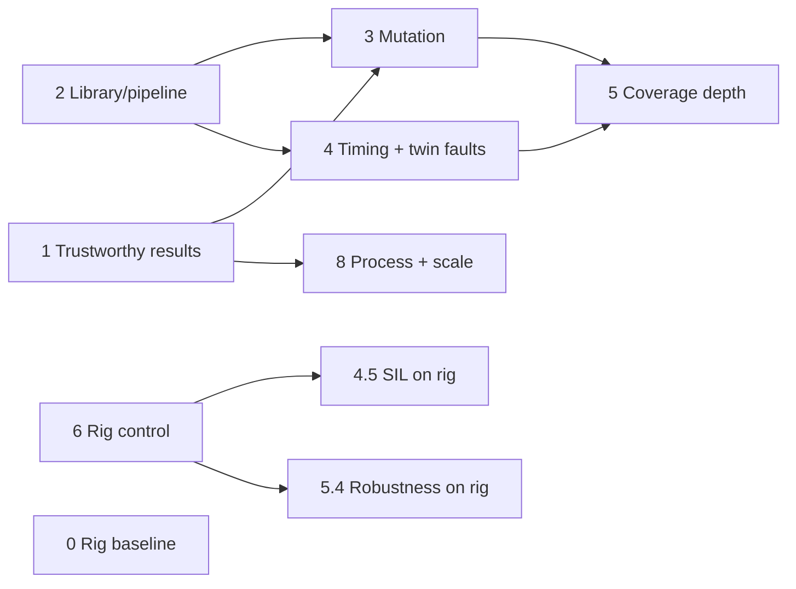

# SMM automation framework — improvement plan

Scope: implement the findings of the architecture review (2026-10-06), **except evidence/ALM integration (former
Phase 7), which the user excluded**: no run manifests or long-term archive, no results history, no publishing to RV&S, no
RV&S defects, no tool-validation dossier. All work, including planning, happens in `D:\projects\AI-TestBench` (branch
`main`), one commit per work package, never push without the user's OK, never modify `D:\projects\SMM TestBench`
(pinned c55073075f06).

## Starting position

| Fact | Value |
|---|---|
| Rig broker (RTC board) | `10.0.1.111:1883` reachable from this PC (TCP check 2026-10-06), appSMM running on the instrument |
| Pilot tests | 25; mock runs 21, offline 25, rig 10 (excludes 11 `requires:restart` and 4 `needs:twin`) |
| Reviewed tests | 0 marked `review:pending`, although none has had a human review |
| Offline failures | 6 candidate findings; **5 of them run on the rig today** (2854109 bridge crash, 2854281, 2653094 after shutdown, 2532510); 2525388 needs `requires:restart` |
| Self-tests | vitest 21, pytest 19, mock 21/21 |

Rig tests drive real mechanics (Initialization up to 600 s, Shutdown, Recover, E-Stop). Every rig run needs the
user's explicit go and an operator at the instrument (no racks or samples loaded, covers closed).

## Decisions taken (assumptions — change if wrong)

1. Unreviewed tests are **run but labelled**, not excluded: `review:pending` no longer excludes a test; the report shows
   `UNREVIEWED` next to its verdict and a spec is only "verified" when all its tests are reviewed.
2. Known failures are tagged `known-issue:FINDING-n` (local IDs, matching README "Findings").
   `smm-auto run` exits non-zero only for new failures; known failures that start passing are reported as `FIXED?`.
3. Fault injection lives in the service only (mock fault modes, a COP proxy in front of the twin); the TestBench stays
   untouched.
4. The framework only reads from RV&S (windchill MCP server, read-only); nothing is written back.
5. Rig restart control is a pluggable adapter configured by environment variables; the first implementation depends on how
   the RTC board can be reached (see open inputs).

## Phase 0 — Rig baseline (needs user go + operator) — 0.5 day

| # | Work | Done when |
|---|---|---|
| 0.1 | Rig pre-flight: `smm-auto doctor --tier rig` checks broker reachable, appSMM answers SystemStatusRequest, records appSMM version and current state, no Bridge client already connected | Command exists and passes |
| 0.2 | Baseline run: `smm-auto run --tier rig --outdir results\rig-baseline` (10 tests) | `output.xml` + `traceability.html` in `results\rig-baseline` |
| 0.3 | Compare the 5 rig-runnable findings with offline: confirmed on real hardware, or twin artefact | README "Findings" updated with rig evidence |

## Phase 1 — Trustworthy results (repo only) — 3–4 days

| # | Finding | Work | Done when |
|---|---|---|---|
| 1.1 | Review status invisible | Tag all 25 pilot tests `review:pending`; stop excluding them; add `Review` column and `UNREVIEWED` badge in `traceability.html`; spec state `VERIFIED` only if every test is reviewed | Report shows 25 unreviewed; pytest covers it |
| 1.2 | No review record | `catalog\reviews.toml` ledger (test, spechash, reviewer, date, PR); CODEOWNERS for `robot\suites\**`; CI check: removing `review:pending` requires a ledger entry with matching spechash | CI fails on an unrecorded tag removal |
| 1.3 | Known failures hide regressions | `known-issue:` tag, report classes `NEW FAIL` / `KNOWN FAIL` / `FIXED?`, `--fail-on new|any` in `smm-auto run`; tag the 6 findings | Offline run is "green with 6 known" and red on any new failure |
| 1.4 | PASS on partial coverage | `PARTIAL` verdict when some tests of a spec were not run on the tier; summary counts it separately | pytest cases for all verdict combinations |
| 1.5 | Rules not enforced | Robocop config + custom checks in `drift --strict`: no `Sleep`, `[Documentation]` cites the spec text, timeouts are variables, `needs:twin` iff hardware keywords used, `requires:restart` iff restart keywords used | CI fails on violations |
| 1.6 | 2 `Sleep` in `bridge_connection.robot` (l.24, 51) | Replace with `Expect No Message … ${QUIET_PERIOD}` (asserts silence instead of waiting). *Implemented as the library keyword `Interrupt Bridge Connection` (outage `${BRIDGE_OUTAGE}`): while the Bridge is disconnected nothing can be observed, so the outage is a stimulus, not a silence assertion.* | 1.5 passes on the suites |
| 1.7 | Thin static quality | ruff + mypy (Python), eslint + `tsc --noEmit` (service), coverage (pytest-cov, vitest coverage) with floors in CI | CI job green, coverage published |
| 1.8 | Reproducibility | Lock Python deps (`uv lock` or pip-tools `requirements.lock`), CI installs from lock; fix `pyproject` package-data `pipeline/templates/*` | Fresh venv from lock reproduces results |

*1.7–1.8 status:* done with pip-tools (`requirements-dev.lock`); the stale `templates` package-data entry was removed
(there are no templates). Follow-up: `npm audit` still reports advisories in the vitest 3 toolchain (tinypool,
@vitest/mocker; dev-only, local test runs) that need the breaking upgrade to vitest 4.

## Phase 2 — Library and pipeline correctness — 2–3 days

| # | Finding | Work |
|---|---|---|
| 2.1 | Trace mark only moved by `Send ICD Message` | Move the mark in `Trigger Hardware Action`, restarts, connect/disconnect; unit tests |
| 2.2 | Sequential waits can match out of order / the same entry | `Wait For Message` returns the matched entry id; new `since=last` (after previous match) as default inside a test; `Wait For Message Sequence` unchanged |
| 2.3 | `Connect As Bridge` mid-test clears evidence | Default `clear=False` after the first connect in a test; timeline keeps a "segment" marker instead |
| 2.4 | `Bring SMM To State` floods SystemStatusRequest | Passive first (last SystemStatusNotification), poll only if unknown; polls tagged `setup` and hidden from assertions |
| 2.5 | `Hardware Command Should Not Be Sent` sleeps | Implement as a quiet-period assertion in the service (`expectNone` on COP trace) |
| 2.6 | Timeline cap 10k silently drops evidence | Configurable cap; overflow flagged in `/session` and fails the test that lost entries |
| 2.7 | Drift ignores multi-spec tests | Per-spec hash tags `spechash:<spec>:<hash>`; stale check for every spec of a test |
| 2.8 | Drift ignores state/link changes | Catalog stores state, requirement links, US links; drift reports `SPEC-STATE-CHANGED` (e.g. back to Draft/Obsolete) and `LINKS-CHANGED` |
| 2.9 | Hash depends on MCP text conversion | Hash a normalised form computed in our code (HTML → text, whitespace/Unicode normalised); one-time re-baseline with a migration note |
| 2.10 | First-keyword area classification | Area comes from the scope file (`area = …` per spec/search), keyword match only as fallback with a warning |

*2.1–2.6 status:* done (service API 1.1.0). Deviation in 2.2: the default window stays "after the last mark"
(not "after the previous match"), but every wait in the default window **consumes** its match and skips earlier
matches and the library's hidden polls (service filter `exclude`); `since=last` is the explicit "after the previous
match". Reason: an implicit order default would turn legitimate reorderings by appSMM into false failures; order is
asserted with `Wait For Message Sequence`. 2.4: the state is read passively from the Bridge session (last
SystemStatusNotification); only one hidden confirming poll per step. 2.6: caps `SMM_TIMELINE_CAP` (20000) and
`SMM_TRACE_CAP` (10000); `Finish SMM Test` fails a test whose evidence was dropped.

*2.7–2.10 status:* done (catalog schema 2, hash version 2). 2.7: `spechash:<spec>:<hash>` per specification; a plain
`spechash:` is only valid on a single-spec test (NO HASH otherwise). 2.8: the catalog keeps an accepted per-spec
**baseline** (state, Satisfies, Described In) across ingestions; drift reports SPEC-STATE-CHANGED / LINKS-CHANGED
until `smm-auto accept`, and RETIRED for covered specs in `retired_states` (retired specs are not UNCOVERED). 2.9:
specs are fetched as rich text and converted by `html_to_text`, then NFKC + typographic punctuation + whitespace
normalised. **Migration note:** re-ingested 2026-10-06 and ran `smm-auto migrate-hashes --from <old catalog>`: every
pilot spec kept its hash except the not-testable overview 2327588 (no test), so no tag or ledger entry changed.
2.10: `[specifications]` is a table area → IDs (`[[searches]]` may carry `area`); keyword areas are a fallback with an
ingest warning and an informational "area guessed" drift list.

## Phase 3 — Prove the tests can fail (mutation) — 3 days

| # | Work |
|---|---|
| 3.1 | Fault modes in the mock appSMM, switchable via `POST /api/v1/mock/faults`: drop message, wrong state, wrong field value, schema-invalid payload, wrong topic, duplicate, reorder, delay N ms |
| 3.2 | Mutant catalogue `catalog\mutants.toml`: each mutant names the spec(s) it violates |
| 3.3 | `smm-auto mutate --tier mock`: runs the affected tests per mutant, reports killed/survived per spec and an overall detection score |
| 3.4 | Nightly CI job; surviving mutants become test-improvement issues; target ≥ 90 % killed |

*3.1–3.4 status:* done (service API 1.2.0). Fault rules are generic (`message`/`when`/`action`/`skip`/`count`) rather
than one mode per row above; "wrong state" and "wrong field value" are `set` rules. Rules reach the mock through
`SMM_MOCK_FAULTS` → `robot\environments\mock.py` overrides, so every mutant is an isolated Robot run and no state can
leak between mutants. A baseline run without faults must pass first. CI job `mutation` (nightly/manual) files an issue
"SMM automation: surviving mutants". Handbook 14.10. First local run: 47 mutants, score 0.979; the one survivor
(`notinitialized-before-poweron`) was a weak mutant (its `reorder` hold was released by an unrelated message), now a
`delay` and killed, so 47/47.

## Phase 4 — Timing and twin fault injection — 3–4 days

| # | Finding | Work |
|---|---|---|
| 4.1 | Spec time limits only covered by timeouts | Keyword `Time Between Should Be Less Than <from> <to> <limit>` using entry `epochMs`; spec limits as variables (`${SDS_2428417_LIMIT}=20s`) independent of tier timeouts |
| 4.2 | Twin has no faults | COP proxy in the service between appSMM and twin: delay, drop, error reply per command (no TestBench change) |
| 4.3 | "Within 20 s" only happy path (2428417, 2532504) | Boundary tests: response just under / over the limit via 4.2 |
| 4.4 | Deferred 2532404, 2532508 | Automate with RTC faults (no `DeInitializeRsp`, rtc_appl not starting) via 4.2 |
| 4.5 | Deferred 2528708, 2528710 | `.sil` (SmartInspect) log reader keyword; on offline read the local log, on rig fetch via the rig adapter (Phase 6) |

*4.1–4.5 status:* done (service API 1.3.0) except the rig log fetch, which moves to Phase 6 (tag `needs:applog` is
excluded on mock and rig until then; lint rule SMM06). 4.1: `Get Time Between`, `Time Between Should Be Less Than` /
`At Least` on entry times; spec limits as `${SDS_<id>_LIMIT}`. 4.2: `copFaults.ts` wraps the twin's COP link inside the
service (drop/delay/error, `skip`/`count`, rules survive appSMM restarts), keywords `Set Hardware Faults` etc.
4.3: boundary tests with a 15 s late reply for 2532504 (DeInitializeRsp) and 2428417 (EmergencyStopRsp, assumed to be
the spec's "StopRsp"); the "over the limit" side is the drop tests of 4.4. 4.4: 2532404 (InitializeCmd dropped) and
2532508 (DeInitializeRsp dropped) → Error after ≥ 20 s. 4.5: `sil.py` + `ICD Messages Should Be Logged By appSMM`
(log location from `trace.config` next to `appSMM.exe`, or `${APPSMM_LOG}`). The `[deferred]` list is now empty.

## Phase 5 — Coverage depth — 4–5 days

| # | Work |
|---|---|
| 5.1 | State model `catalog\smm-states.toml`: states (incl. transient Initializing, Clearing, Configuring), requests, expected response/transition, spec reference or `unspecified` |
| 5.2 | Generated state × request matrix suite (Robot test template, one row per cell); `unspecified` cells produce questions for the spec owner instead of assertions |
| 5.3 | Robustness suite with `Send Raw Payload`: invalid JSON, schema-invalid, unknown message, wrong topic, duplicate requests, burst; expected behaviour per ICD (no crash, error response or ignore) |
| 5.4 | Robustness on rig only after offline is clean and with the user's go |

*5.1–5.3 status:* done; 5.4 waits for the user's go. 5.1: the model is `catalog\state-matrix.toml` (stable states
NotInitialized, Idle, E-Stop × 5 requests = 15 cells; transient states are reached only through hand-written tests,
since a request cannot be timed into them reliably). 5.2: `smm-auto matrix` generates `state_matrix.robot` for the 8
cells no hand-written test covers and `state-matrix.questions.md` for the spec owner; open cells SKIP with appSMM's
observed answer; CI runs `matrix --check`. 5.3: `robustness.robot` (11 `nospec:robustness` input tests, a second
InitializationRequest during Initializing, a burst of 50 SystemStatusRequests); `nospec:<kind>` tests are reported
apart. Offline (appSMM 0.7.2305.25001): 21 tests, 17 pass, 4 skip, 0 fail. Observed in the open cells: ShutdownRequest
in NotInitialized → OK but stays NotInitialized; in E-Stop → OK, stays E-Stop; SetConfigurationRequest in Idle and in
E-Stop → per-key `Error`, state unchanged. The mock appSMM crashed on a `null`/array payload (fixed, regression test).

## Phase 6 — Real-hardware coverage — depends on rig access

| # | Finding | Work |
|---|---|---|
| 6.1 | 11 `requires:restart` tests never run on rig | `RigControl` adapter (`SMM_RIG_CONTROL=ssh://…` or a site script): restart appSMM, restart broker, fetch logs; service exposes it through the existing restart endpoints |
| 6.2 | Fixed tier exclusions | Capability-based selection: tier declares capabilities (`restart`, `twin`, `operator`), `smm-auto` computes excludes; rig gains `restart` when 6.1 is configured |
| 6.3 | 4 `needs:twin` tests never run on rig | `Operator Action` keyword (prompt + confirm, tag `needs:operator`) for rack pick-up/fatal error, or real actuation where a safe command exists |
| 6.4 | CI hardware job assumes runner setup | Job checks out / verifies the TestBench pin and runs `doctor --tier rig` first |

*6.1–6.4 and 0.1 (the command) status:* done in the repo; nothing has run against the real instrument yet (Phase 0
and the site's rig control script are still open). Deviation in 6.1: the rig control lives on the Python side
(`smm_automation\rigcontrol.py`, a site program named by `SMM_RIG_CONTROL` with the subcommands `capabilities`,
`restart-appsmm`, `restart-broker`, `fetch-log`) instead of behind the service's restart endpoints, so the service
and its API (1.3.0) are unchanged and a long-running service does not need the variable; the library picks the rig
control whenever the part's kind is `external`. 6.2: `smm_automation\capabilities.py` maps tags to capabilities
(`restart`, `broker-restart`, `twin`, `hardware-action`, `operator`, `applog`); `smm-auto run` prints what it
excludes and why. 6.3: `Operator Action` (tag `needs:operator`) and an operator E-Stop (`needs:hardware-action`,
`--operator console|dialog`); the rack tests stay `needs:twin` until a safe clean-up procedure exists; lint SMM07
checks the new tags. 0.1/6.4: `smm-auto doctor [--tier] [--operator] [--deep]`; the CI hardware job runs it before
the tests.

## Phase 8 — Process and scale — 3–4 days

| # | Work |
|---|---|
| 8.1 | Reviewer agent runs on a different model than the author agent; writes its verdict into the review ledger (1.2) as `reviewer = agent:<model>`; human review still required |
| 8.2 | Multi-session service (session id per run, own broker port) → pabot on mock/offline; target offline < 8 min |
| 8.3 | API token for the service (even on localhost) |
| 8.4 | Move `known_icd_messages` / schema lookup behind the service API (Python no longer reads the TestBench path) |
| 8.5 | Handbook + README updated for every phase (tags, verdicts, commands, checklists) |

*8.1 status:* done. `smm-auto review <test | SDS-id> --reviewer <name | agent:<model>> --verdict …` appends to
`catalog\reviews.toml` at the test's current spechash; verdicts are `approved`, `approved-with-notes`,
`changes-requested`, `rejected` (a missing verdict reads as `approved`). Only a person's approving entry clears
UNRECORDED; agent entries appear in drift ("Agent reviews") and next to UNREVIEWED in the report. The model cannot be
pinned in the agent file, so "a different model than the author" is a documented instruction (`/model`), and the
reviewer agent states it when it runs on the same model.

## Order and dependencies

Phase 7 (evidence and ALM) was removed at the user's request; the numbering is kept so references stay stable.
Phases 1 and 2 can start immediately and in parallel with Phase 0.

### Effort estimate — what the numbers mean

The day figures per phase are a rough **size** of each work package in engineer-days, to compare phases and plan
reviews. They are not a schedule and not the time the agent needs to write the code.

| Phase | Days |
|---|---|
| 0 Rig baseline | 0.5 |
| 1 Trustworthy results | 3–4 |
| 2 Library and pipeline | 2–3 |
| 3 Mutation | 3 |
| 4 Timing and twin faults | 3–4 |
| 5 Coverage depth | 4–5 |
| 8 Process and scale | 3–4 |
| **Total** | **≈ 19–24** |
| 6 Rig control | not estimated until the remote-control method of the RTC board is known |

Elapsed time is driven mostly by things outside the code: rig runs (user go + operator, Initialization up to 10 min
each), full offline runs (~17 min each) and human review of every new or changed test.

## Open inputs needed from the user

1. Go for Phase 0 rig runs, and who is the operator at the instrument.
2. How the RTC board can be controlled remotely (OS, SSH or service manager, where credentials are kept) → Phase 6.
3. Who confirms the 6 candidate findings with the appSMM team → README "Findings".
