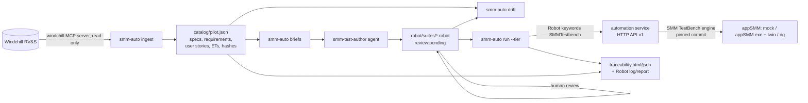

# SMM test automation framework

Automated system tests for the SMM (7251 Sample Management Module), traced to Windchill RV&S.

> **New to this framework?** Read the [SMM Automation Handbook](../docs/SMM-AUTOMATION-HANDBOOK.md): a step-by-step guide
> for installing, running, writing and maintaining the tests, written for non-specialists.



| Part | Where | What |
|---|---|---|
| Automation service | `service/` (TypeScript) | Headless service built **from the SMM TestBench sources at the commit pinned in `testbench.lock.json`**. Acts as the SMM Bridge (MQTT, ICD v7 schemas), runs the environment of a tier (broker, appSMM, hardware twin), records a timeline of every message and offers waits/sequence matching over HTTP API v1 (`127.0.0.1:8765/api/v1`). |
| Robot keyword library | `src/smm_automation/SMMTestbench.py` | `Connect As Bridge`, `Send ICD Message`, `Wait For Message`, `Wait For Message Sequence`, `Message Should Not Arrive`, `Wait For Hardware Command`, schema checks, timeline HTML in the log... Starts the service automatically. |
| Robot resources / tiers | `robot/resources/smm.resource`, `robot/environments/<tier>.py` | Shared setup/teardown and the timeouts per tier. |
| Suites | `robot/suites/<scope>/<area>.robot` | Tests tagged `SDS-<spec id>` and `spechash:<8 hex>`. Nothing else is linked in the tests: requirements, user stories and ETs come from RV&S at report time. |
| Pipeline | `src/smm_automation/pipeline/` | `ingest` (RV&S -> catalog), `briefs` (generation input for the agent), `drift` (suites vs catalog), `report` (traceability). |
| Catalog | `catalog/<scope>.scope.toml` -> `catalog/<scope>.json` | Which specifications are in scope, which are deferred / not testable (with the reason), area keywords. |

## Tiers

| Tier | appSMM | Hardware | Use | Excluded tags |
|---|---|---|---|---|
| `mock` | scripted mock in the service | none | framework self-test, CI on every push. **Verdicts are not product evidence.** | `needs:twin` |
| `offline` | real `appSMM.exe` on this PC | SMM TestBench hardware twin | developer PC, nightly | — |
| `rig` | real appSMM on the instrument | real | dedicated automation instrument (`SMM_RIG_BROKER=host:port`) | `needs:twin`, `requires:restart` |

`review:pending` tests run on every tier and are labelled UNREVIEWED in the report (`--exclude-pending` leaves them out).
`smm-auto run` exits with the number of **new** failures: failures of tests tagged `known-issue:FINDING-<n>` (see
Findings) are KNOWN FAIL and keep the run green (`--fail-on any` counts them too).

## Setup (Windows)

```powershell
# 1. SMM TestBench at the pinned commit (default D:\projects\SMM TestBench, else set SMM_TESTBENCH_DIR)
git -C "D:\projects\SMM TestBench" checkout <commit from testbench.lock.json>
npm ci --prefix "D:\projects\SMM TestBench\simulator"; npm ci --prefix "D:\projects\SMM TestBench\hwsim"

# 2. Service
cd smm-automation\service; npm ci; npm run build; npm test

# 3. Python (pinned versions from the lock file, then the package itself)
cd ..; py -3.12 -m venv .venv; .\.venv\Scripts\pip install -r requirements-dev.lock; .\.venv\Scripts\pip install --no-deps -e .
.\.venv\Scripts\python -m pytest
```

Code quality checks (all in CI): `npm run lint`, `npm run typecheck`, `npm run coverage` in `service`;
`ruff check src tests`, `mypy`, `python -m pytest --cov` (coverage floors in `pyproject.toml` and
`service\vitest.config.ts`). After changing dependencies in `pyproject.toml`, re-create the lock:
`.\.venv\Scripts\pip-compile --extra dev --strip-extras --no-emit-index-url -o requirements-dev.lock pyproject.toml`.

RV&S access (`ingest` only) uses the windchill MCP server of this repository (`windchill-mcp-server/src/server.js`,
override with `WINDCHILL_MCP_SERVER`) with the `RVS_*` settings from the environment or `~/.copilot/mcp-config.json`.

## Daily use

```powershell
.\.venv\Scripts\smm-auto ingest                 # RV&S -> catalog/pilot.json (prints what changed since the last run)
.\.venv\Scripts\smm-auto drift --strict         # stale hashes, orphans, uncovered specs, lint (exit 1 on problems)
.\.venv\Scripts\smm-auto lint                   # test rules SMM01-05 (no Sleep, doc quotes spec, variable timeouts, tier tags)
.\.venv\Scripts\smm-auto briefs --spec 2528698  # generated/briefs/SDS-2528698.md for the authoring agent
.\.venv\Scripts\smm-auto run --tier mock        # results/mock-<ts>/: log.html, report.html, traceability.html/json
.\.venv\Scripts\smm-auto run --tier offline --include initialization   # extra args go to robot
.\.venv\Scripts\smm-auto --suites robot\suites\pilot\recover.robot run --tier offline
.\.venv\Scripts\smm-auto report --output results\rig-20261005-101500\output.xml
```

## Writing tests

1. `smm-auto ingest` and `smm-auto drift`: uncovered specifications are listed per area.
2. `smm-auto briefs --spec <id>`: the brief holds the spec text, linked requirements/user stories/ETs, the ICD
   schemas of the messages it mentions, the keyword documentation, the tags to use and the target suite.
3. The `smm-test-author` agent (`.github/agents/smm-test-author.agent.md`) writes the test from the brief, tagged
   `review:pending`. Optionally the `smm-test-reviewer` agent (`.github/agents/smm-test-reviewer.agent.md`)
   gives an independent, read-only review (APPROVE / CHANGES REQUESTED / REJECT).
4. A test engineer reviews it against the specification (and runs it on `offline`/`rig`), records the review in
   `catalog/reviews.toml` (test, spechash, reviewer, date, PR) and removes `review:pending` in the same change.
   `drift --strict` fails on a test without `review:pending` and without a matching human review entry.
5. When RV&S changes the specification text, `drift` reports the test as **stale**: re-review, then update `spechash:`.

Rules: one behaviour per test, assert what the specification states (message, fields, order, topic, timing), wait for
events (never `Sleep`), only use keywords from the library/resource, add `needs:twin` if hardware-twin state is
required and `requires:restart` if appSMM or the broker must be restarted. Timeouts are variables (time limits stated
by a specification as `${SDS_<id>_LIMIT}` in the suite). `smm-auto lint` and `robocop check robot` enforce these rules
in CI (handbook Section 11.3). Each wait consumes the message it matched; order is asserted with
`Wait For Message Sequence` (or `since=last`), not by consecutive waits (handbook Section 10.2).

## Reports

`traceability.html` lists every in-scope specification with its verdict (FAIL, NOT RUN, UNCOVERED, SKIP, PARTIAL,
DEFERRED, PASS, NOT TESTABLE), its review status (VERIFIED = passed and every test human-reviewed, UNREVIEWED), the
tests with their outcome (PASS, NEW FAIL, KNOWN FAIL, FIXED?) and messages, stale/suspect flags, and rolls the verdicts
up to requirements and user stories (worst verdict wins). PARTIAL means some tests of the specification passed and
others did not run on this tier. Robot's `log.html` holds the full message timeline of every test. On the `mock`
tier the report carries a banner: those verdicts test the framework, not appSMM.

## Pilot status

Scope `catalog/pilot.scope.toml`: Initialization, Recover, Shutdown, System Status and Bridge connection,
26 specifications (21 automated, 4 deferred, 1 not testable).

> **The pilot suites were written by the authoring agent and still need a human review against the
> specifications before their verdicts are used as evidence.** Open points are listed in the test documentation
> (e.g. the real appSMM's answer to InitializationRequest outside NotInitialized is only logged).

Deferred: 2528708/2528710 (appSMM logs are SmartInspect `.sil` files; no reader yet), 2532404/2532508 (need RTC
fault injection in the hardware twin).

### Findings on appSMM 0.7.2305.25001 (offline tier)

The offline tier runs the real appSMM against the hardware twin. With the pilot suites it shows these differences
between the specifications and that build. They are **candidate findings, not confirmed defects**: the build is
from 2023 and the specifications are newer, so a human has to confirm each one (or correct the test) first.

| ID | Specification | Observed | Consequence |
|---|---|---|---|
| FINDING-1 | SDS-2854109 (Bridge crash) | After the SMMBridge last will "SMMBridge Disconnected" appSMM stays `Idle`; a broker outage does put it into `E-Stop` | SDS-2854281 (Operator warning on reconnection) fails on its precondition |
| FINDING-2 | SDS-2653094, SDS-2532510 (Recover) | Recover goes `E-Stop` -> `NotInitialized` (DeInitializeCmd); no automatic initialization, no InitializeCmd | |
| FINDING-3 | SDS-2525388 (PowerOn) | No SystemStatusNotification with `CurrentState=PowerOn` after a start (SystemStatusResponse does report `PowerOn`), only `PowerOn` -> `NotInitialized` | |

The failing tests are tagged `known-issue:FINDING-<n>`, so an offline run with only these failures is green and any
other failure is reported as NEW FAIL. When a finding is fixed or rejected, remove the tag (the report shows FIXED?
when a tagged test passes).

Open interpretation for the reviewer: SDS-2854281 is tested as "warning after reconnection and RecoverRequest"; the
test accepts the warning from the moment of reconnection on.

Known appSMM behaviour the suites take into account: after InitializationRequest the empty instrument goes
`Initializing` -> `Idle` -> `Clearing` -> `Idle`; with a rack on the instrument it goes to `NormalOperation`, and appSMM
keeps its rack bookkeeping across Shutdown/Recover, so tests that load racks empty the twin and restart appSMM in
their teardown.
